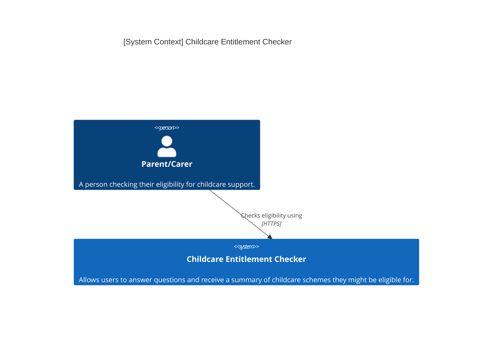
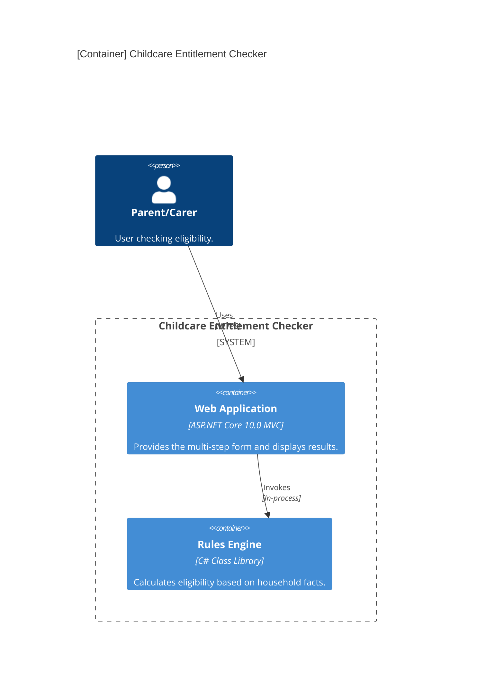

## Level 1: System Context
The highest level of abstraction, showing how the system interacts with users.

## Level 2: Container Diagram
Shows the high-level technology building blocks.

## Project Structure

The solution is divided into two primary functional projects:

1.  Web: Follows standard ASP.NET Core MVC patterns. Manages the stateful user journey across multiple pages.
2.  RulesEngine: A pure logic library containing no web-specific dependencies.
