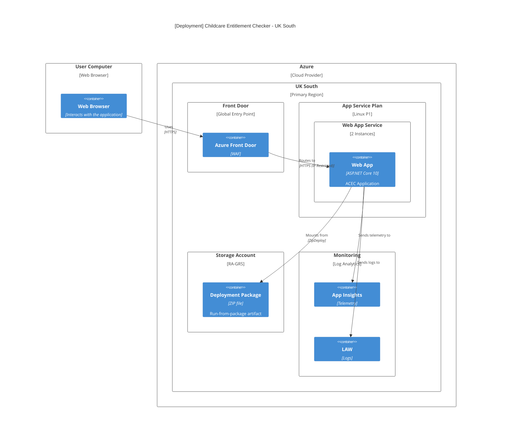

This document describes the cloud architecture, networking, and deployment strategy for the Accessing Childcare Entitlement Checker (ACEC). The ACEC application is a stateless ASP.NET Core web application hosted on Azure. It is designed for high availability, security, and scalability within the UK South region.

## Deployment Diagram

## Infrastructure Components

| Component  | Service                    | SLA           | Description                                                              |
|:-----------|:---------------------------|:--------------|:-------------------------------------------------------------------------|
| Edge       | Azure Front Door           | 99.99%        | Global entry point, SSL termination, and Web Application Firewall (WAF). |
| Compute    | Azure App Service          | 99.95%        | Hosts the ASP.NET Core package-based application.                        |
| Storage    | Azure Storage Account      | 99.99% (read) | Read-Access Geo-Redundant Storage Account for deployment artifacts.      |
| Monitoring | Azure Application Insights | N/A           | Distributed tracing, performance monitoring, and application logs.       |
| Logging    | Log Analytics Workspace    | N/A           | Centralized store for platform and application logs (30-day retention).  |

Basion is not included as this is not required for day to day running and is only required for developer access at intermittent times

### Availability

The table shows the composite availability. All Services is for when the entire system is running.

|         Scenario         | Availability |
|:------------------------:|:------------:|
|       All Services       |    99.93%    |

Approx downtime:

* ~30 minutes/month
* ~6.1 hours/year

## Networking & Security

### Ingress Protection

* Front Door WAF: Configured in Prevention mode using the Microsoft Default Rule Set.
* App Service Restrictions: The Web App is configured with IP restrictions to only accept traffic from the `AzureFrontDoor.Backend` service tag. This ensures users cannot bypass the WAF.

## Availability & Scaling

* Region: All resources are pinned to `UK South`.
* Redundancy: 
  * The Web App is planned to run with minimum 2 instances for high availability.
  * The deployment strategy utilises Run-From-Package backed by an RA-GRS (Read-Access Geo-Redundant Storage) account to ensure the deployment artifact is resilient.
* Statelessness: The application is entirely stateless. No session affinity (Sticky Sessions) is required on Front Door, and no external database is used for the core checker logic.

## Deployment Strategy

The project follows a Trunk-Based Development model with Release Branches for higher environments.

### Environments

* Development / Test: Automatically deployed from the `main` branch.
* Staging / Production: Deployed from stable `release/vX.Y` branches.

### CI/CD Pipeline (GitHub Actions)

1. Build: Compiles the .NET application and creates a deployment ZIP.
2. Infrastructure: Terraform (using OIDC for Azure authentication) ensures the environment is provisioned and configured.
3. Deploy: The ZIP package is deployed to the App Service using the `az webapp deploy` (Zip Deploy) method.

## Monitoring

* Observability: Application Insights tracks request latency, failure rates, and custom exceptions.
* Retention: Logs are retained in the Log Analytics Workspace.
