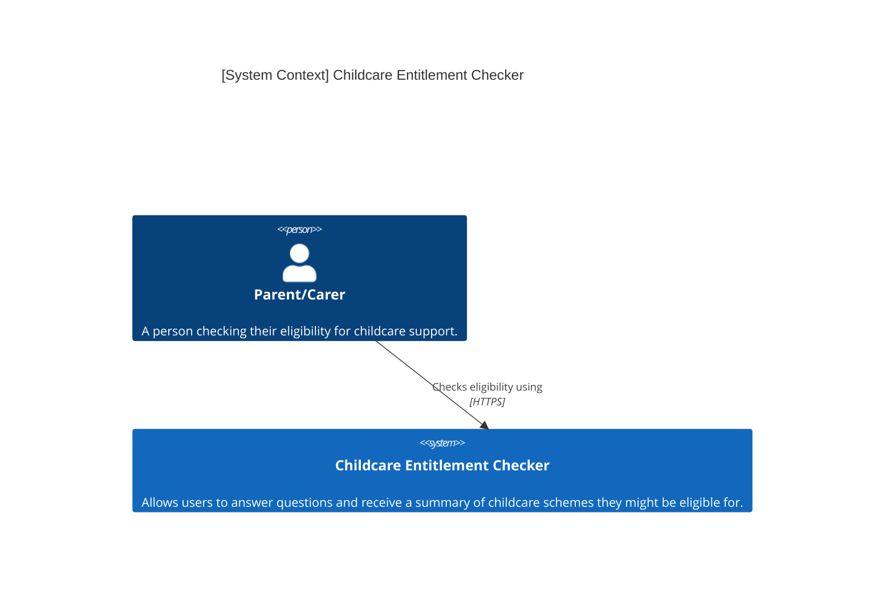
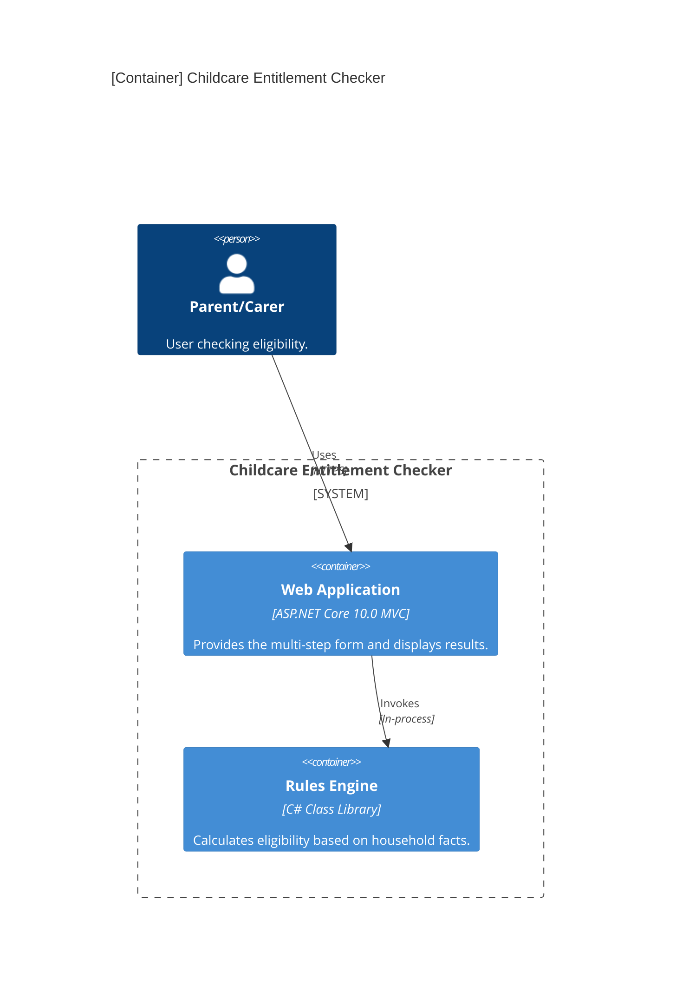
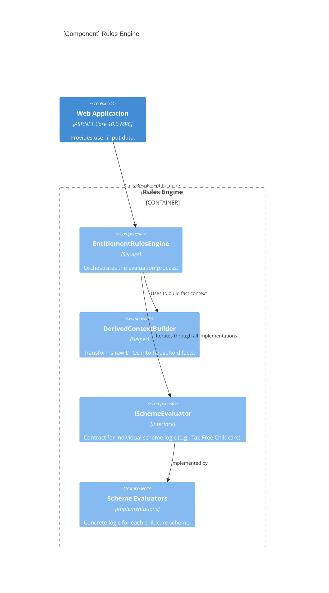

## Level 1: System Context
The highest level of abstraction, showing how the system interacts with users.

## Level 2: Container Diagram
Shows the high-level technology building blocks.

## Level 3: Component Diagram (Rules Engine)
Shows the internal structure of the Rules Engine and how it processes eligibility.

## Project Structure

The solution is divided into two primary functional projects:

1.  **Web**: Follows standard ASP.NET Core MVC patterns. Manages the stateful user journey across multiple pages.
2.  **RulesEngine**: A pure logic library containing no web-specific dependencies. It uses a "Fact-based" approach where raw user input is mapped to a `DerivedContext` before being evaluated by a suite of independent `ISchemeEvaluator` implementations.

