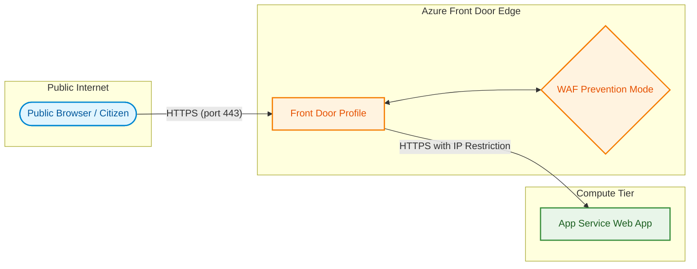

This document describes the network architecture, traffic flow, and security controls for the Accessing Childcare Entitlement Checker (ACEC). It details how traffic from public users securely reaches the web application and how the application is secured from direct public internet access.

## Network topology overview

The system uses a direct routing model with Azure Front Door acting as the global entry point. Public users access the application via Front Door, which provides SSL termination and Web Application Firewall (WAF) protection. The backend Web App is hosted on Azure App Service and is configured with IP restrictions to only accept traffic from Azure Front Door.

## Inbound traffic routing (Ingress)

Public user requests flow through the following sequence of network boundaries:

### Azure Front Door (Global edge)
1. DNS Resolution: Users access the application via a custom domain or the default Front Door endpoint.
2. TLS Termination: Front Door terminates SSL/TLS (v1.2+) at the edge.
3. Web Application Firewall (WAF): The Front Door WAF enforces the Microsoft Default Rule Set in prevention mode, defending against OWASP Top 10 exploits, SQL injections, and cross-site scripting (XSS).
4. Origin Routing: Checked and sanitized traffic is routed to the backend App Service origin.

### App Service access restrictions (Backend isolation)
The Web App is hosted on Azure App Service and is strictly isolated to prevent bypass of the Front Door edge:
* Service Tag Filtering: The Web App's built-in access restriction rules are configured with a `Deny All` default action. A single `Allow` rule permits ingress only from the `AzureFrontDoor.Backend` service tag, validating that requests passed through the Front Door profile and WAF.

## Outbound traffic routing (Egress)

Because the application is stateless and does not connect to internal databases or backend APIs inside a Virtual Network, it does not require regional Virtual Network Integration or private endpoints. Outbound traffic (such as Application Insights telemetry, platform logs, and outbound calls) flows securely over standard encrypted paths (HTTPS) directly to the respective Azure platform endpoints.
