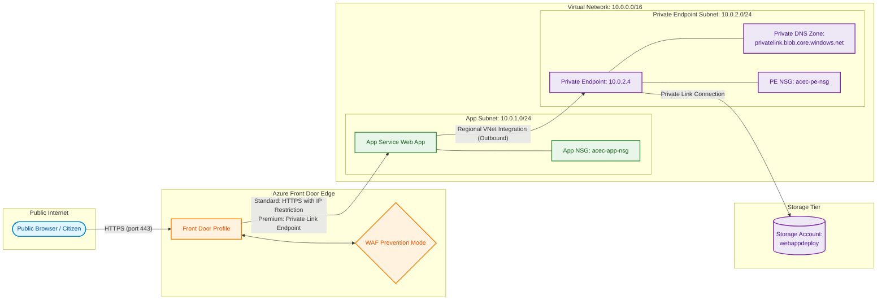
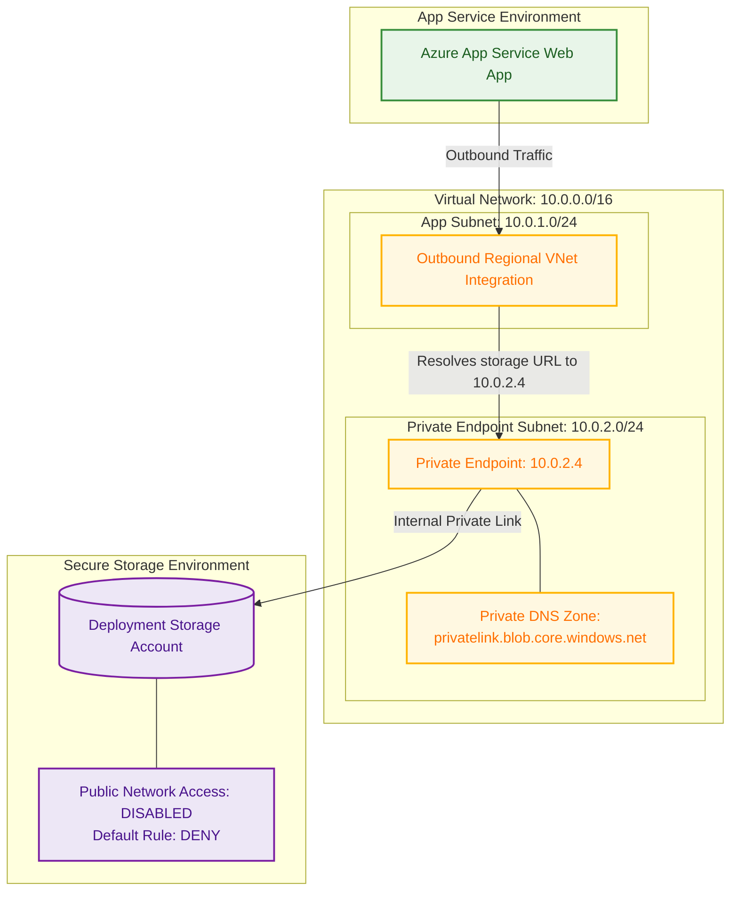

This document describes the network architecture, traffic flow, Virtual Network (VNet) topology, and security controls for the Accessing Childcare Entitlement Checker (ACEC). It details how traffic from public users securely reaches the web application and how the application securely accesses internal cloud resources on Azure.

## Network Topology Overview

The system uses a hub-and-spoke design with Azure Front Door acting as the global entry point (the hub) and a Virtual Network (VNet) hosting the web application's regional integration and private endpoints (the spoke). This ensures that public-facing endpoints are protected by an enterprise-grade Web Application Firewall (WAF), and internal backend components (such as storage accounts containing deployment packages) are isolated from the public internet.

## IP Address Allocation (CIDR Blocks)

The core networking environment is defined in the Virtual Network (`10.0.0.0/16`). It is partitioned into subnets to segregate resource workloads and control traffic via Network Security Groups (NSGs):

| Subnet Name             | CIDR Range    | Resource Delegation / Service Endpoints                                            | Network Security Group (NSG) | Description                                                                            |
|:------------------------|:--------------|:-----------------------------------------------------------------------------------|:-----------------------------|:---------------------------------------------------------------------------------------|
| App Subnet              | `10.0.1.0/24` | `Microsoft.Web/serverFarms` (Delegation) `Microsoft.Storage` (Service Endpoint) | `acec-app-nsg`               | Dedicated subnet for regional App Service outbound VNet Integration.                   |
| Private Endpoint Subnet | `10.0.2.0/24` | `NetworkSecurityGroupEnabled` (Policies Enabled)                                   | `acec-pe-nsg`                | Dedicated subnet hosting Private Endpoints for secure, internal cloud resource access. |

## Inbound Traffic Routing (Ingress)

Public user requests flow through the following sequence of network boundaries:

### Azure Front Door (Global Edge)
1. DNS Resolution: Users access the application via a custom domain or the default Front Door endpoint.
2. TLS Termination: Front Door terminates SSL/TLS (v1.2+) at the edge.
3. Web Application Firewall (WAF): The Front Door WAF enforces the Microsoft Default Rule Set in prevention mode, defending against OWASP Top 10 exploits, SQL injections, and cross-site scripting (XSS).
4. Origin Routing: Checked and sanitized traffic is routed to the backend App Service origin.

### App Service Access Restrictions (Backend Isolation)
The Web App is hosted on Azure App Service and is strictly isolated to prevent bypass of the Front Door edge:
* Service Tag Filtering: The Web App's built-in access restriction rules are configured with a `Deny All` default action. A single `Allow` rule permits ingress only from the `AzureFrontDoor.Backend` service tag.
* Front Door Premium Option (Private Link): When utilizing the *Premium* Azure Front Door SKU, the origin connection uses Azure Private Link (`private_link` target type: `sites`), bypassing public routing entirely and channeling traffic over Microsoft's private backbone network.

## Outbound Traffic Routing (Egress)

When the Web App needs to execute outbound network communication (e.g., retrieving configuration, shipping logs, or mounting the deployment package), it routes traffic securely using the following patterns:

### Regional VNet Integration
The App Service is configured with Outbound VNet Integration pointing to the App Subnet (`10.0.1.0/24`). This assigns the App Service instances private IP addresses from the `10.0.1.0/24` range and forces outbound traffic to honor the virtual network's routing and NSG rules.

### Network Security Groups (NSGs)
* App Subnet NSG (`acec-app-nsg`): Controls traffic originating from the App Service instances. Outbound internet access is restricted, while traffic to delegated Azure services and subnets is permitted.
* Private Endpoint Subnet NSG (`acec-pe-nsg`): Locks down access to the private endpoints. Network security policies are enabled (`privateEndpointNetworkPolicies = "NetworkSecurityGroupEnabled"`), allowing the NSG to restrict inbound access to the private endpoints only from the App Subnet.

## Storage Account Network Isolation

The storage account (`webappdeploy`) stores the application's compiled deployment package (ZIP artifact) and is securely integrated into the network topology using Private Endpoints:

### Key Security Configurations:
1. Public Access Disabled: `public_network_access_enabled = false` blocks all standard inbound requests from the public internet.
2. Default Deny Rule: The Storage Account network rules set `default_action = "Deny"`. It only permits access via the regional App Subnet ID using service endpoints as a backup/validation path.
3. Private Endpoint (`acec-deployment-pe`): Provisioned on the Private Endpoint Subnet (`10.0.2.0/24`), providing a direct, private IP address (within the virtual network space) for the Storage Account's Blob service.
4. Private DNS Zone Link: A private DNS zone (`privatelink.blob.core.windows.net`) is linked to the virtual network. This ensures that any lookup of the Storage Account’s host URL by the App Service resolves to the private IP address (`10.0.2.x`) instead of a public IP.
