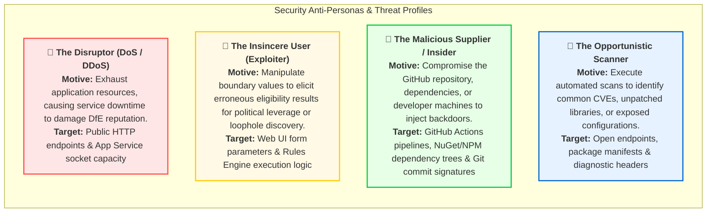
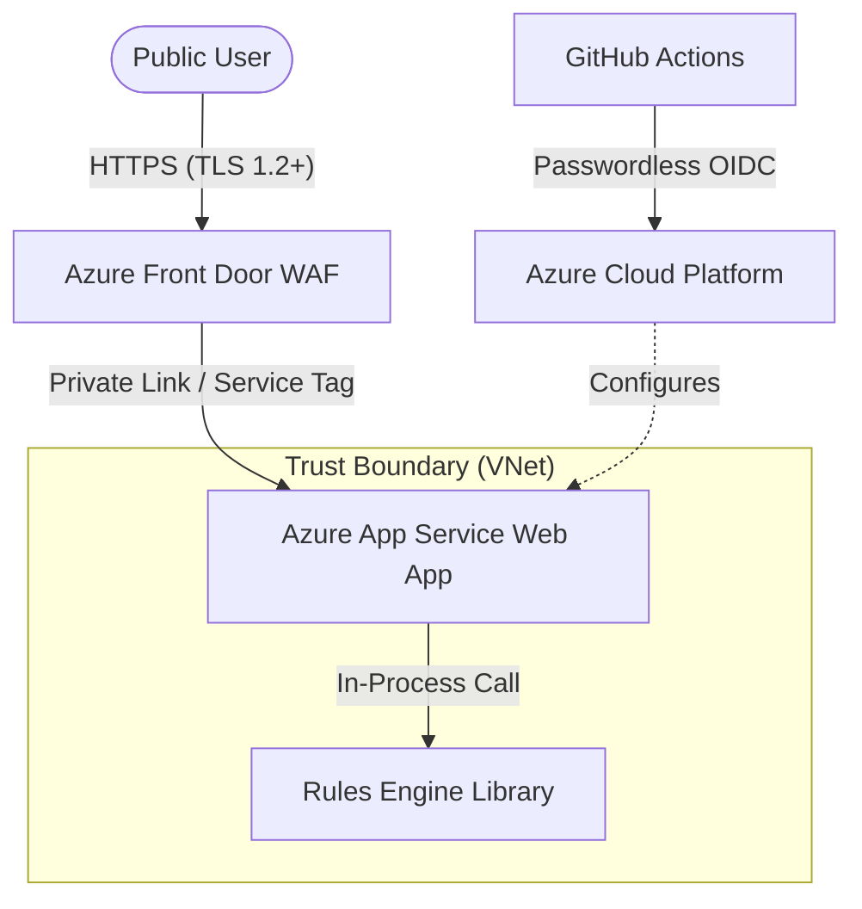

This document defines the Security Architecture for the Accessing Childcare Entitlement Checker (ACEC). It establishes our defensive posture, identifies key actors, models threats, analyzes potential attack vectors, and defines the information security profile.

As a public-facing, anonymous tool with no database and no persistent user accounts, the primary security goals of this service are:
1. Application & Logic Integrity: Ensuring the Rules Engine executes statutory childcare calculations accurately and without tampering.
2. Availability: Ensuring the public-facing service remains resilient to Denial of Service (DoS) attacks.
3. Session Privacy: Protecting transient, in-memory household facts supplied by citizens during a session.
4. DevSecOps & Supply Chain Security: Hardening deployment pipelines and verifying third-party packages to block malicious code injection.

## Roles

The service categorises actors and components into the following distinct functional roles:

### Public user (Citizen / parent / carer)
* Access Level: Anonymous, read-only public access.
* Authentication: None.
* Permissions: Accesses the multi-step questionnaire, submits transient household details (such as child date of birth, estimated household income, and eligibility criteria), and views calculated childcare entitlement results.
* Security Scope: Confined entirely to the user's local web browser session. No mechanism exists for public users to access backend administration, log systems, or write files.

### Web application (App Service runtime)
* Access Level: High trust within the execution container.
* Authentication: System-assigned Managed Identity (passwordless) for accessing cloud platform services.
* Permissions: Stores transient user answers in-memory using encrypted browser-side session cookies. Serves HTML/CSS/JS frontend to public users. Calls the in-process Rules Engine to perform entitlement calculations.
* Security Scope: Isolated inside a virtual network (VNet). Communication with other resources is locked down via network security rules and Front Door service tags.

### Rules engine (In-process library)
* Access Level: Internal dependency.
* Authentication: Non-applicable (invoked in-process).
* Permissions: Exposes pure functions that map input facts (`ChildFacts`) to entitlement outputs.
* Security Scope: Immutable library packaged with the Web Application. It contains no external networking code or database hooks, preventing any lateral movement or external command injection at this layer.

### Deployment identity (GitHub actions runner)
* Access Level: Administrative (privileged deployment).
* Authentication: Passwordless OpenID Connect (OIDC) federated credentials with Azure Entra ID.
* Permissions: Provisions Azure infrastructure using Terraform and deploys compiled .NET release artifacts to the App Service.
* Security Scope: Governed by repository environment rules, branch protections, and peer-reviewed workflow definitions.

### Cloud operations / site reliability engineer (SRE)
* Access Level: Highly privileged.
* Authentication: Microsoft Entra ID utilizing Multi-Factor Authentication (MFA), Single Sign-On (SSO), and Just-In-Time (JIT) elevation via Privileged Identity Management (PIM).
* Permissions: Read-only operational oversight in production by default. JIT access is required to view platform logs, modify key vaults, or debug infrastructure issues.
* Security Scope: Strictly audited via Azure Activity Logs and Log Analytics Workspace.

## Anti-personas

To inform our threat modelling, we identify the following active threats, their corresponding motives, and their targeted assets:

## Threat modelling (STRIDE)

We utilise the STRIDE methodology to systematically evaluate security boundaries across our architecture. Due to the lack of a backend database, our main threat boundaries are User to Web App and CI/CD to Cloud Infrastructure.

### STRIDE assessment & mitigations

| Threat Category        | Description                                                                                                        | Local Mitigation                                                                                                                                                                                                                                                              |
|:-----------------------|:-------------------------------------------------------------------------------------------------------------------|:------------------------------------------------------------------------------------------------------------------------------------------------------------------------------------------------------------------------------------------------------------------------------|
| Spoofing               | An attacker impersonates a valid deployment pipeline or administrative user to manipulate the hosting environment. | OIDC Deployment: GitHub Actions uses short-lived, passwordless federated credentials. MFA & PIM: Operations accounts require multi-factor authentication and Just-In-Time permission elevation.                                                                            |
| Tampering              | An attacker alters the transient session cookie or manipulates HTTP POST payload inputs to bypass rules.           | Encrypted Sessions: Session states are signed and encrypted natively by ASP.NET Core using Data Protection APIs. Model Validation: All incoming form fields undergo strict server-side model validation prior to Rules Engine execution.                                   |
| Repudiation            | An attacker makes changes to the system or infrastructure configurations that cannot be traced.                    | Comprehensive Audit Logging: Infrastructure modifications are tracked via Terraform state locks and Azure Activity Logs. Signed Commits: Repository code changes require signed commits and pull-request peer reviews.                                                     |
| Information Disclosure | The application leaks technical stack traces, configuration secrets, or sensitive system details.                  | Custom Error Pages: ASP.NET Core is configured to return generic, user-friendly error views in production (`/Home/Error`) while suppressing raw stack traces. Secret Scanning: Automated Git workflows block commits containing keys, certificates, or connection strings. |
| Denial of Service      | Botnets or high-volume automated requests saturate the App Service, making the checker unavailable.                | Azure Front Door (AFD) WAF: Rate limiting rules are configured at the edge. DDoS Protection: Leveraging Azure's global DDoS infrastructure to absorb volumetric attacks before they reach the App Service origin.                                                          |
| Elevation of Privilege | An attacker exploits an unpatched vulnerability in a NuGet package to gain shell access inside the container.      | Dependabot & CodeQL: Continuous static application security testing (SAST) and automated pull requests for outdated/vulnerable packages. Non-Root Containers: App Services run on modern Linux containers under unprivileged process contexts.                             |

## Attack vectors

Based on the application's design, we monitor and actively defend against the following major attack vectors:

### Vector a: Web UI parameter & input tampering
* Mechanism: Crafting malicious HTTP requests that bypass browser-side HTML5 restrictions (e.g., submitting out-of-bounds dates, extremely high financial values, or negative age numbers).
* Defensive Controls: 
  1. Strict Server-Side Validation: The Web controller validates models using C# strongly-typed classes (such as `DateOfBirth` ranges) before invoking the rules.
  2. Type Safety: The Rules Engine expects rigid, type-safe structures (`ChildFacts`) which cannot execute with invalid field mappings.

### Vector b: Cross-site scripting (XSS) & injection
* Mechanism: Injecting malicious JavaScript payloads into input fields (such as child names in free-text boxes, if utilized) to execute scripts in other users' browsers or leak session cookies.
* Defensive Controls:
  1. Automatic HTML Encoding: Razor Views automatically HTML-encode all dynamic values before rendering.
  2. Content Security Policy (CSP): Configured via HTTP response headers to permit only trusted script and style sources, preventing execution of inline injected scripts.
  3. HttpOnly Cookies: Session cookies are flagged as `HttpOnly`, `Secure`, and `SameSite=Strict`, blocking scripts from accessing session tokens.

### Vector c: Software supply chain / dependency vulnerabilities
* Mechanism: Exploiting vulnerabilities in third-party NuGet packages or frontend NPM dependencies utilized to compile and build the site.
* Defensive Controls:
  1. Dependency Locking: All NuGet packages are locked via `packages.lock.json` to prevent arbitrary upstream updates during compilation.
  2. Automated Vulnerability Alerts: GitHub Dependabot scans all project files (`.csproj`, `package.json`) and flags vulnerable dependencies.
  3. Static Application Security Testing (SAST): CodeQL runs automatically on pull requests to identify potential code-level vulnerabilities.

### Vector d: Infrastructure & pipeline tampering
* Mechanism: Compromising developer credentials to modify `.github/workflows/` or directly push untracked code into main.
* Defensive Controls:
  1. Branch Protection Rules: Direct pushes to the `main` branch are blocked. Merges require at least one approving peer review and successful completion of the CI build pipeline.
  2. Audit Logging: Continuous tracking of user access and pipeline configurations in Azure and GitHub.

## Information security profile

The Information Security Profile defines how the service categorises, protects, and governs data.

### No database / zero persistence strategy
* Zero Storage of Personal Data: The application does not deploy a database (such as SQL Database, CosmosDB, or Redis). No citizen names, addresses, or financial records are stored anywhere in the hosting environment.
* Transient Session State: All user progress is held strictly in memory inside the short-lived user session. Once the user closes their browser or remains idle, the session is purged entirely.
* No "Save and Resume" capability: This eliminates the risk of SQL injection or direct data breaches, drastically reducing the system's compliance and audit footprint.

### Cryptographic protections
* In-Transit Encryption: 
  * HTTPS is enforced globally with TLS 1.2 minimum version.
  * All HTTP requests are automatically redirected to HTTPS.
  * HSTS (HTTP Strict Transport Security) headers are issued to browsers to prevent downgrade attacks.

### Security logging and compliance
* Zero PII Logging: System logs (Log Analytics / Application Insights) record technical telemetry, response latency, and generic routing data. Logs must not contain user inputs, child dates of birth, or household financial figures.
* Automated DAST Scanning: OWASP ZAP (Zed Attack Proxy) is executed as part of the pipeline to perform Dynamic Application Security Testing (DAST) on deployment to non-production environments, verifying that no high-risk vulnerabilities are exposed in the live application context.
