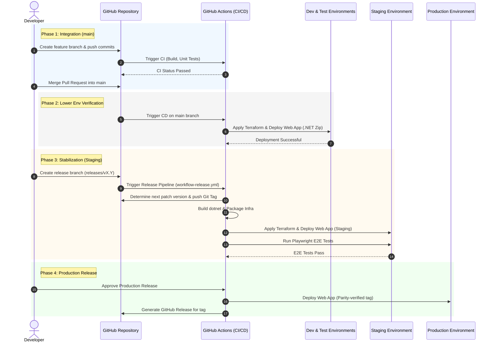

The "Path to Live" describes the journey of code changes from a developer's local machine to the production environment, ensuring robust quality assurance, automated regression testing, and controlled promotions.

The diagram below outlines the sequential phases and quality gates:

### Local Development
* Developers implement features and bug fixes in short-lived feature branches created from `main`.
* Local testing is performed including executing unit/component tests and linting.
* Changes are submitted via a Pull Request (PR) to `main`.

### Integration & Continuous Deployment (Dev & Test)
* Quality Gate: Raising a PR triggers the Continuous Integration (CI) pipeline, executing builds, unit tests, and security scans.
* Upon merging into `main`, GitHub Actions automatically:
    1. Build and compile the ASP.NET Core package.
    2. Apply infrastructure changes using Terraform.
    3. Deploy the application package to both Development and Test environments.
* Continuous feedback is provided to the team as these environments always run the latest integrated code.

### Release Stabilization (Staging)
* When a set of features is ready for release, a release branch is branched off `main` following the naming convention `releases/vX.Y` (where `X.Y` corresponds to the target Major.Minor release version).
* Pushing to a `releases/` branch triggers the Release Pipeline (`workflow-release.yml`):
    * Automatic Versioning: The pipeline validates the branch name, fetches git tags, determines the next patch version (e.g., `v1.2.0` or incrementing to `v1.2.1`), and automatically creates and pushes the tag to GitHub.
    * Build & Infrastructure packaging: Builds the .NET application zip and packages the Terraform infrastructure configurations.
    * Staging Deployment: The Terraform configurations are applied and the zip package is deployed to the Staging environment.
    * Automated E2E Verification: Playwright integration/E2E regression tests are executed automatically against the active Staging URL to ensure functional integrity.

### Promotion to Production
* Once the release candidate is fully validated in Staging (incorporating E2E testing, accessibility audits, and stakeholder/UAT sign-offs):
    * Production Deployment: The release package is promoted and deployed to the Production environment (using the matching version tag to ensure exact artifact parity).
    * *Note: Continuous automated deployment to production and automated accessibility checking are currently built into the pipeline structure and can be fully promoted following manual sign-off.*
    * GitHub Release: A formal GitHub Release is generated for the successful deployment with the corresponding version tag.