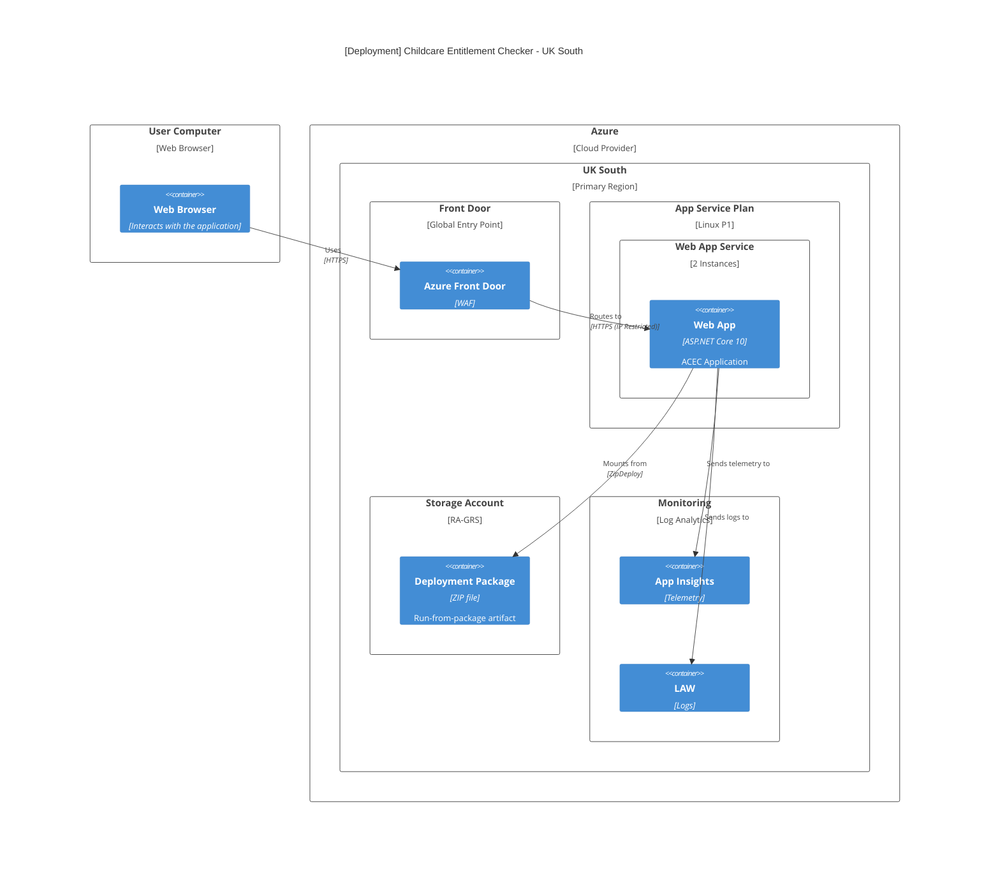
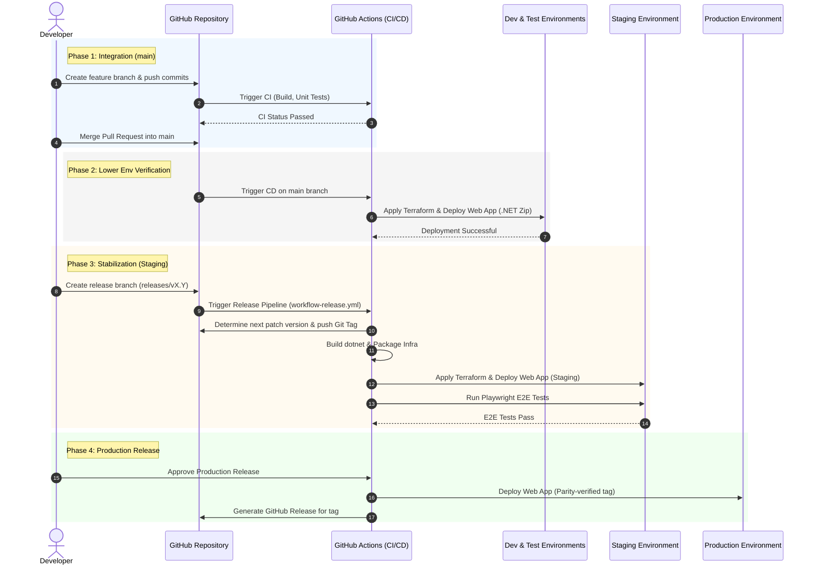

This document describes the cloud architecture, networking, and deployment strategy for the Accessing Childcare Entitlement Checker (ACEC). The ACEC application is a stateless ASP.NET Core web application hosted on Azure. It is designed for high availability, security, and scalability within the UK South region.

## Deployment Diagram

## Infrastructure Components

| Component  | Service                    | SLA           | Description                                                              |
|:-----------|:---------------------------|:--------------|:-------------------------------------------------------------------------|
| Edge       | Azure Front Door           | 99.99%        | Global entry point, SSL termination, and Web Application Firewall (WAF). |
| Compute    | Azure App Service          | 99.95%        | Hosts the ASP.NET Core package-based application.                        |
| Storage    | Azure Storage Account      | 99.99% (read) | Read-Access Geo-Redundant Storage Account for deployment artifacts.      |
| Monitoring | Azure Application Insights | N/A           | Distributed tracing, performance monitoring, and application logs.       |
| Logging    | Log Analytics Workspace    | N/A           | Centralized store for platform and application logs (30-day retention).  |

### Availability

The table shows the composite availability. All Services is for when the entire system is running.

|         Scenario         | Availability |
|:------------------------:|:------------:|
|       All Services       |    99.93%    |

Approx downtime:

* ~30 minutes/month
* ~6.1 hours/year

## Networking & Security

### Ingress Protection

* Front Door WAF: Configured in Prevention mode using the Microsoft Default Rule Set.
* App Service Restrictions: The Web App is configured with IP restrictions to only accept traffic from the `AzureFrontDoor.Backend` service tag. This ensures users cannot bypass the WAF.

## Availability & Scaling

* Region: All resources are pinned to `UK South`.
* Redundancy: 
  * The Web App is planned to run with minimum 2 instances for high availability.
  * The deployment strategy utilises Run-From-Package backed by an RA-GRS (Read-Access Geo-Redundant Storage) account to ensure the deployment artifact is resilient.
* Statelessness: The application is entirely stateless. No server-side session affinity (Sticky Sessions) is required. Multi-step form state is maintained via encrypted session cookies (ASP.NET Core Data Protection), allowing any App Service instance to handle any request.

## Deployment Strategy

The project follows a Trunk-Based Development model with Release Branches for higher environments.

### Environments

* Development / Test: Automatically deployed from the `main` branch.
* Staging / Production: Deployed from stable `release/vX.Y` branches.

### CI/CD Pipeline (GitHub Actions)

1. Build: Compiles the .NET application and creates a deployment ZIP.
2. Infrastructure: Terraform (using OIDC for Azure authentication) ensures the environment is provisioned and configured.
3. Deploy: The ZIP package is deployed to the App Service using the `az webapp deploy` (Zip Deploy) method.

## Path to Live

The "Path to Live" describes the journey of code changes from a developer's local machine to the production environment, ensuring robust quality assurance, automated regression testing, and controlled promotions.

The diagram below outlines the sequential phases and quality gates:

### 1. Local Development
* Developers implement features and bug fixes in short-lived feature branches created from `main`.
* Local testing is performed including executing unit/component tests and linting.
* Changes are submitted via a Pull Request (PR) to `main`.

### 2. Integration & Continuous Deployment (Dev & Test)
* **Quality Gate:** Raising a PR triggers the Continuous Integration (CI) pipeline, executing builds, unit tests, and security scans.
* Upon merging into `main`, GitHub Actions automatically:
  1. Build and compile the ASP.NET Core package.
  2. Apply infrastructure changes using Terraform.
  3. Deploy the application package to both **Development** and **Test** environments.
* Continuous feedback is provided to the team as these environments always run the latest integrated code.

### 3. Release Stabilization (Staging)
* When a set of features is ready for release, a release branch is branched off `main` following the naming convention `releases/vX.Y` (where `X.Y` corresponds to the target Major.Minor release version).
* Pushing to a `releases/**` branch triggers the **Release Pipeline** (`workflow-release.yml`):
  * **Automatic Versioning:** The pipeline validates the branch name, fetches git tags, determines the next patch version (e.g., `v1.2.0` or incrementing to `v1.2.1`), and automatically creates and pushes the tag to GitHub.
  * **Build & Infrastructure packaging:** Builds the .NET application zip and packages the Terraform infrastructure configurations.
  * **Staging Deployment:** The Terraform configurations are applied and the zip package is deployed to the **Staging** environment.
  * **Automated E2E Verification:** Playwright integration/E2E regression tests are executed automatically against the active Staging URL to ensure functional integrity.

### 4. Promotion to Production
* Once the release candidate is fully validated in Staging (incorporating E2E testing, accessibility audits, and stakeholder/UAT sign-offs):
  * **Production Deployment:** The release package is promoted and deployed to the **Production** environment (using the matching version tag to ensure exact artifact parity).
  * *Note: Continuous automated deployment to production and automated accessibility checking are currently built into the pipeline structure and can be fully promoted following manual sign-off.*
  * **GitHub Release:** A formal GitHub Release is generated for the successful deployment with the corresponding version tag.

## Monitoring

* Observability: Application Insights tracks request latency, failure rates, and custom exceptions.
* Retention: Logs are retained in the Log Analytics Workspace.
