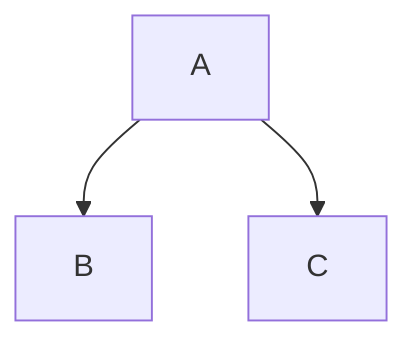

This project uses [Eleventy](https://www.11ty.dev/) and the [X-GOVUK plugin](https://x-govuk.github.io/govuk-eleventy-plugin/) to generate DfE-branded technical documentation from Markdown files.

## Local development

To preview your changes locally:

1.  Navigate to the `docs` directory.
2.  Run `npm install` (first time only).
3.  Run `npm start`.
4.  View at `http://localhost:8080/`.

## Adding a new document

### Create the file
Create a new `.md` file in one of the existing directories (`architecture/`, `decisions/`, `opetional/`, `runbook/`, `testing/`, or `developers/`).

### Add front matter
Every page needs "Front Matter" at the top to set the title and navigation key. 

```markdown
---
title: My New Page Title
eleventyNavigation:
  key: My Page Key
---
```
> [!TIP]
> **Note**: You don't need to set `layout` or `parent` for individual files. These are automatically applied based on the folder you put the file in.

## Diagrams (Mermaid)

You can include diagrams using standard Markdown code blocks:



These are rendered on the client side using a custom script that ensures they are responsive and DfE-branded.

## Deployment
Documentation is automatically built and deployed to GitHub Pages whenever you:
- Push to `main`
- Create/update a Pull Request (build validation only)
