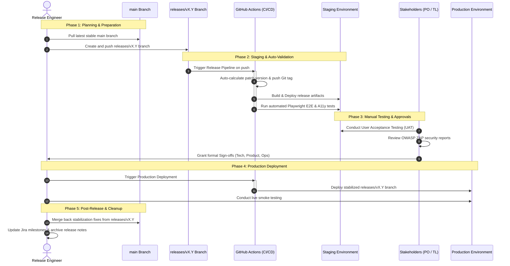

This document describes the operational release process for the Accessing Childcare Entitlement Checker. It acts as the operational and governance counterpart to the [Branching Strategy](../03-branching-strategy) workflow, ensuring that changes are safely promoted and validated.

## Overall release steps

The release process is broken down into five distinct phases, moving code from integration to live operation.



### Phase 1: Planning and preparation

1. Identify the Scope: Review the merged pull requests on the `main` branch since the last release. Group features and bug fixes into a logical release version.
2. Version Assignment: Determine the next major/minor version number using Semantic Versioning (e.g., `vX.Y`).
3. Create the Release Branch:
   - Create a release branch named `releases/vX.Y` from the latest stable commit on `main`. Note the plural `releases/` name prefix, which is strictly validated by the CI/CD configuration.
   - Command:
     ```bash
     git checkout main
     git pull
     git checkout -b releases/vX.Y
     git push -u origin releases/vX.Y
     ```

### Phase 2: Staging and automated validation

1. Trigger Staging Deployment & Automated Versioning: Pushing to the `releases/vX.Y` branch triggers the GitHub Release Pipeline.
   - Automated Tagging & Versioning: The pipeline immediately runs the `version` job which validates the branch name, checks the existing Git tags to calculate the next patch version (e.g., `vX.Y.0` or `vX.Y.1`), and automatically creates and pushes the Git tag to the repository. *Do not manually create or push version tags; the pipeline fully automates this step.*
   - Staging Deployment: The pipeline builds the release artifacts and deploys them automatically to the Staging environment.
2. Automated Verification:
   - Once deployed, the automated End-to-End (E2E) test suite runs using Playwright against Staging.
   - Automated accessibility checks are executed against Staging to ensure compliance with digital standards.
   - Verify that the automated pipeline completes successfully with zero critical or high-severity failures.

### Phase 3: Manual testing and approvals

While automated tests provide safety, manual validation ensures the service meets user and operational requirements:

1. User Acceptance Testing (UAT): The Product Owner and business testers review the new features on Staging to ensure they meet the defined acceptance criteria.
2. Exploratory & Regression Testing: Conduct targetted manual testing of critical paths (such as the eligibility calculator flow) to ensure no regressions have been introduced.
3. Security Check: Check that any weekly OWASP ZAP security scan reports have been reviewed, and that no new high/medium alerts are unresolved.
4. Sign-Off Acquisition: Collect and log formal approvals from key roles (see [Approvals](#approvals) below).

### Phase 4: Production deployment

1. Schedule the Release Window: Ensure the deployment is scheduled during an approved operational window (preferably low-traffic periods) and does not clash with critical policy change dates.
2. Deploy to Production:
   - Trigger the deployment workflow in GitHub Actions, targeting the stabilized `releases/vX.Y` branch.
   - Monitor the deployment progress, logs, and system metrics closely during the rollout.
3. Smoke Testing: Once the deployment completes, the delivery and engineering team must perform a quick, non-destructive smoke test of the live service to confirm core functionality (such as loading the landing page and verifying basic site elements).

### Phase 5: Post-release and cleanup

1. Verify Release Tag: Double-check that the automated release tag was correctly generated and pushed by the pipeline, and verify the GitHub Release description is populated correctly.
2. Reconciliation (Cherry-Pick / Merge Back):
   - If any bug fixes or configuration changes were made directly on the `releases/vX.Y` branch during the stabilisation phase, they must be cherry-picked or merged back into `main` via PR to prevent codebase drift.

## Approvals

To ensure safety and quality, a release must pass three gates before it can be deployed to the live production environment. Each role is responsible for a specific aspect of system health.

### 1. Technical sign-off
* Owner: Lead Engineer / Technical Lead
* Verification Scope:
  - All automated unit, component, and E2E checks passed.
  - No critical/high static analysis warnings or dependency alerts (Dependabot) are outstanding.
  - Architectural patterns have been followed and documented where necessary.
  - Active security scans (OWASP ZAP) show no high-risk vulnerabilities.

### 2. Product sign-off
* Owner: Product Owner / Product Manager
* Verification Scope:
  - Features meet user expectations and functional specifications.
  - UX design conforms to GDS and DfE standards.
  - User Acceptance Testing (UAT) is complete and signed off by business stakeholders.
  - Release-specific content, guidance text, or legal references are accurate.

### 3. Operations & delivery sign-off
* Owner: Delivery Manager / Service Owner
* Verification Scope:
  - The deployment is scheduled for an approved window.
  - Communication channels are prepped and stakeholders are aware of potential service updates.
  - Runbooks and operational documentation are up-to-date.
  - Support/helpdesk teams have been informed of upcoming user-facing changes.

### Sign-off matrix

| Role             | Gate                      | Prerequisite for                    |
|:-----------------|:--------------------------|:------------------------------------|
| Technical Lead   | Technical Sign-Off        | Transition to UAT & Prod Deployment |
| Product Owner    | Product Sign-Off          | Prod Deployment                     |
| Delivery Manager | Release Schedule Sign-Off | Prod Deployment                     |

## Emergency / hotfix releases

When a critical production defect is identified (e.g., service outage, security vulnerability, or critical policy miscalculation), the release process is streamlined for speed while preserving safety:

1. Authorization: An emergency meeting is convened with the Tech Lead and Product Owner to agree on the fix scope and authorize an emergency hotfix.
2. Branching: A fix is developed on a `hotfix/*` branch off the active release branch as described in the [Hotfix Flow](../03-branching-strategy/#hotfix-flow).
3. Promotion:
   - The fix is merged into the active `releases/vX.Y` branch.
   - It is automatically deployed to Staging and validated via Playwright automated tests.
4. Approval Shortcut: The technical sign-off and product sign-off can be granted concurrently on the PR itself to fast-track deployment.
5. Production Push: The updated release branch is deployed immediately to Production.
6. Reconciliation: Immediately after the production deployment, the hotfix is cherry-picked back to `main` to ensure the master branch is not drifted.
