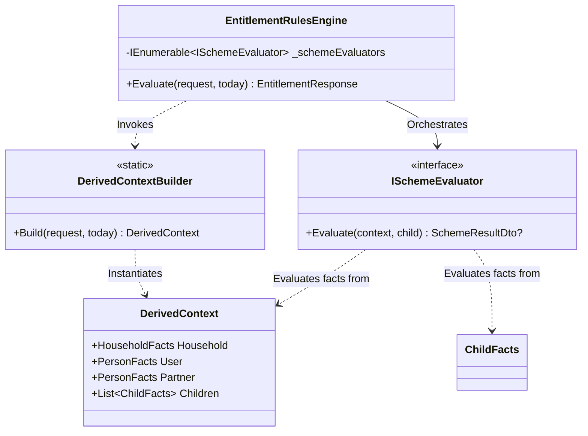

This guide provides an technical overview of the `AccessingChildcareEntitlementChecker.RulesEngine` project. It describes the architectural design, the design patterns employed, and how to extend the engine to support new childcare entitlement schemes.

## Overview

The Rules Engine is a pure C# class library containing no web-specific, database, or state-handling dependencies. It is designed around a deterministic input-output model:
1. It accepts an `EntitlementRequest` DTO containing raw user inputs (household details, user/partner details, children).
2. It maps and enriches these raw inputs into a structured context of business-centric Facts.
3. It iterates through a collection of registered Scheme Evaluators (rules).
4. It returns an `EntitlementResponse` DTO summarizing the current and future eligibility for each child.

## Architectural Design

To maintain a clean separation of concerns and high extensibility, the Rules Engine relies on three primary design patterns.



### The Strategy Pattern (Rules Evaluation)
The core evaluation architecture uses the GoF Strategy Pattern.

* The Strategy Interface (`ISchemeEvaluator`): Defines a common contract for evaluating a childcare scheme.
  ```csharp
  public interface ISchemeEvaluator
  {
      SchemeResultDto? Evaluate(DerivedContext context, ChildFacts child);
  }
  ```
* Concrete Strategies: Each childcare entitlement scheme (e.g., Tax-Free Childcare, 15 Hours Universal, 30 Hours Working Families) is modeled as an independent class implementing `ISchemeEvaluator` (e.g., `TaxFreeChildcareEvaluator`).
* The Strategy Context (`EntitlementRulesEngine`): Orchestrates the loop. It receives an `IEnumerable<ISchemeEvaluator>` via Dependency Injection (DI) and executes them sequentially.

#### Benefits
* Open-Closed Principle (OCP): Adding a new childcare scheme does not require modifying `EntitlementRulesEngine`. You simply write a new class implementing `ISchemeEvaluator` and register it in DI.
* Separation of Concerns: Each evaluator handles its own eligibility criteria, keeping code files small, highly readable, and easily testable.

### The Fact / Specification Pattern (Logical Abstraction)
Rather than executing complex business logic directly on the transport-layer objects (`EntitlementRequest`), the engine converts inputs into semantic Facts represented by:
* `DerivedContext`: Holds all consolidated facts for a single evaluation run.
* `HouseholdFacts`: Holds derived facts about the home (e.g., whether they live in Great Britain).
* `PersonFacts`: Holds derived facts about a parent or partner (e.g., whether they earn above the threshold or receive a specific exemption benefit).
* `ChildFacts`: Holds derived facts about a child (e.g., calculated age in years and months).

#### Benefits
* Decoupled Evaluation Logic: Evaluators are insulated from changes to the raw request DTO schemas. If the API payload structure changes, only the mapping layer is updated.
* Readable Business Rules: Rule assertions read like natural English regulatory policies. For example, `child.AgeInYears is >= 3 and <= 4` instead of complex inline date math on every check.

### Data Mapper / Static Factory (Context Construction)
The `DerivedContextBuilder` acts as a Data Mapper / Static Factory that encapsulates the logic for translating raw DTO inputs into business-centric Facts. 

* State Model: It exposes a single static mapping method: `DerivedContextBuilder.Build(request, today)`.
* Data Enrichment: Beyond simple property copying, the builder enriches the data. For instance, it calculates the child’s decimal age in years and months relative to `today` via `AgeCalculations`, and checks access to public funds based on nationality and visa status.

## Technical Naming Conventions

The Rules Engine follows strict, explicit naming conventions to align with its underlying patterns:

1. Concrete Strategy Evaluators: Always suffixed with `Evaluator` (e.g., `TaxFreeChildcareEvaluator`), reflecting the evaluation action.
2. Logical Fact Models: Always suffixed with `Facts` (e.g., `HouseholdFacts`, `ChildFacts`) to distinguish them from transport DTOs or entity models.
3. Data Transport Objects: Always suffixed with `Dto` (e.g., `ChildDto`, `SchemeResultDto`) to clearly denote network or boundary model boundaries.

## Evaluator Principles

When writing or extending evaluators, it is critical to adhere to the following design principles:
* Evaluators must be independent. Each evaluator must operate in isolation and must not rely on the execution or results of other evaluators.
* Evaluators must not call other evaluators. Let the orchestration engine handle execution of individual schemes.
* Evaluators must not mutate the context. The `DerivedContext` and `ChildFacts` objects must be treated as read-only.
* Evaluators should be deterministic. Given the same context, they must always return the exact same result.
* Evaluators should only consume Facts. Do not evaluate or read raw request DTOs directly within an evaluator; rely on the semantic facts prepared in the context.

## Step-by-Step Guide: Adding a New Childcare Scheme

Follow these steps to introduce a new childcare entitlement scheme to the Rules Engine.

### Step 1: Declare the Scheme Code
Add a new enum value representing the scheme in `src/AccessingChildcareEntitlementChecker.RulesEngine/Types/SchemeCode.cs`:
```csharp
public enum SchemeCode
{
    // Existing schemes...
    NewEntitlementScheme
}
```

### Step 2: Implement the Evaluator
Create a new file in the `src/AccessingChildcareEntitlementChecker.RulesEngine/Schemes` folder named `NewEntitlementSchemeEvaluator.cs`. Implement `ISchemeEvaluator`:

```csharp
using AccessingChildcareEntitlementChecker.RulesEngine.Derived;
using AccessingChildcareEntitlementChecker.RulesEngine.Dtos.Responses;
using AccessingChildcareEntitlementChecker.RulesEngine.Evaluators;
using AccessingChildcareEntitlementChecker.RulesEngine.Types;

namespace AccessingChildcareEntitlementChecker.RulesEngine.Schemes;

public class NewEntitlementSchemeEvaluator : ISchemeEvaluator
{
    private const int MinimumEligibleAge = 2;

    public SchemeResultDto? Evaluate(DerivedContext context, ChildFacts child)
    {
        // 1. Assert household and individual requirements
        var eligibleNow = 
            context.Household.CountryOfResidence == CountryOfResidence.England &&
            child.IsBorn &&
            child.AgeInYears >= MinimumEligibleAge;

        var eligibleInFuture = 
            context.Household.CountryOfResidence == CountryOfResidence.England &&
            !child.IsBorn;

        // 2. Return null if absolutely ineligible now and in the future
        if (!eligibleNow && !eligibleInFuture)
        {
            return null;
        }

        // 3. Return the result
        return new SchemeResultDto
        {
            SchemeCode = SchemeCode.NewEntitlementScheme,
            EligibleNow = eligibleNow,
            EligibleInFuture = eligibleInFuture
        };
    }
}
```

### Step 3: Register the Strategy
Open `src/AccessingChildcareEntitlementChecker.RulesEngine/Extensions/ServiceCollectionExtensions.cs` and register your new evaluator with the service collection:

```csharp
public static IServiceCollection AddRulesEngine(this IServiceCollection services)
{
    services.AddScoped<EntitlementRulesEngine>();

    // Register Scheme Evaluators
    services.AddScoped<ISchemeEvaluator, UniversalCreditChildcareEvaluator>();
    services.AddScoped<ISchemeEvaluator, FifteenHoursUniversalEvaluator>();
    services.AddScoped<ISchemeEvaluator, TaxFreeChildcareEvaluator>();
    services.AddScoped<ISchemeEvaluator, ThirtyHoursForWorkingFamiliesEvaluator>();
    services.AddScoped<ISchemeEvaluator, FifteenHoursForDisadvantagedChildrenEvaluator>();
    services.AddScoped<ISchemeEvaluator, NewEntitlementSchemeEvaluator>(); // <-- Add your new evaluator here

    return services;
}
```

### Step 4: Write Unit Tests
Create a new unit test class in the test suite `tests/AccessingChildcareEntitlementChecker.UnitTests/RulesEngine/Schemes/NewEntitlementSchemeTests.cs`. Write unit tests verifying various facts and permutations.

## Testing Patterns & Doubles

To test the orchestrator (`EntitlementRulesEngine`) in complete isolation from the real policy rules, the test suite uses the Test Fakes pattern instead of complex mock frameworks.

Inside `EntitlementRulesEngineTests.cs`, two lightweight in-memory fake strategies are declared:
```csharp
private class FakeEligibleSchemeEvaluator : ISchemeEvaluator
{
    public SchemeResultDto? Evaluate(DerivedContext context, ChildFacts child)
    {
        return new SchemeResultDto { SchemeCode = SchemeCode.UniversalCreditChildcare, EligibleNow = true };
    }
}

private class FakeIneligibleSchemeEvaluator : ISchemeEvaluator
{
    public SchemeResultDto? Evaluate(DerivedContext context, ChildFacts child)
    {
        return null;
    }
}
```
This keeps orchestrator unit tests incredibly fast, deterministic, and free of dependency configuration.
