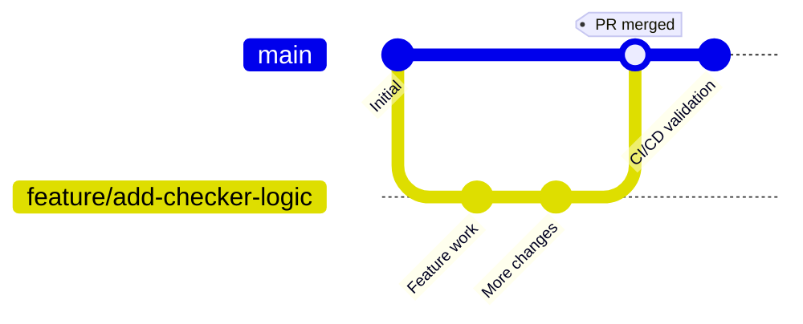
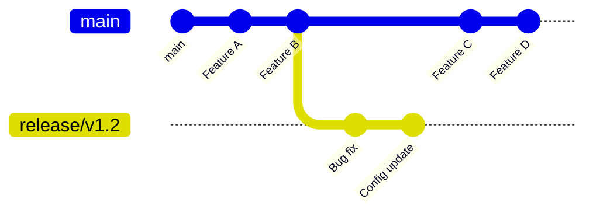
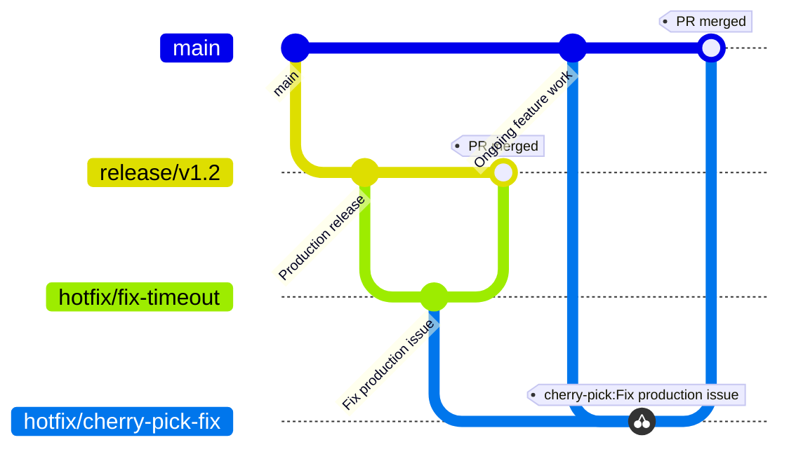

This document defines the Git branching and release workflow for the project. The project uses:

* Trunk-based development
* Short-lived feature branches
* Short-lived release branches
* PR-driven delivery
* Controlled production releases

## Goals

The branching strategy aims to:

* Keep integration fast and simple
* Maintain continuous delivery readiness
* Allow safe staging and production validation
* Support low-risk hotfixes
* Avoid long-lived environment branches
* Minimise merge conflicts and branch drift
* Ensure all production changes are reviewed via PRs

## Branch Types

### Trunk Branch

`main` is the primary integration branch.

**Rules:**

* All feature work is merged into `main`
* `main` must remain deployable
* CI/CD validates every merge
* `main` automatically deploys to:

    * Development
    * Test

**Expectations:**

Developers should:

* Merge small, frequent changes
* Rebase frequently
* Avoid long-running feature branches
* Use pull requests for review and validation

### Release Branches

Release branches provide a stable snapshot for staging and production validation.

**Naming Convention:**

```text
release/vX.Y
```

**Rules:**

Once created:

* No new features may be added
* Only the following changes are allowed:

    * Bug fixes
    * Release-critical configuration changes
    * Documentation/version updates
    * Approved hotfixes
* All changes must be introduced through PRs

**Purpose:**

Release branches are used to:

* Stabilise a release candidate
* Support UAT/regression testing
* Deploy safely to staging and production
* Isolate production releases from ongoing development

## Overall Workflow

### Development Flow



**Flow Summary:**

1. Developer creates a branch from `main`
2. Feature work is completed
3. Pull request opened
4. CI/CD validates changes
5. Changes merged into `main`
6. `main` deploys automatically to:

    * Development
    * Test

### Release Flow



**Flow Summary:**

1. Create a release branch from `main`
2. Stabilise the release
3. Deploy release branch to staging
4. Complete:

    * E2E testing
    * Accessibility testing
    * Regression testing
    * UAT/signoff
5. Deploy release branch to production

### Hotfix Flow



**Flow Summary:**

1. Create a hotfix branch from the active release branch
2. Raise a PR into the release branch
3. Validate through CI/CD
4. Deploy the updated release branch to staging/production
5. Cherry-pick the fix into a new branch from `main`
6. Raise a PR back into `main`

## Branch Protection

The following protections should be enabled for `main` and `release/*` branches:

* Pull requests required
* Status checks required
* No direct pushes
* Linear history
* Required approvals
* CI checks must pass before merge
