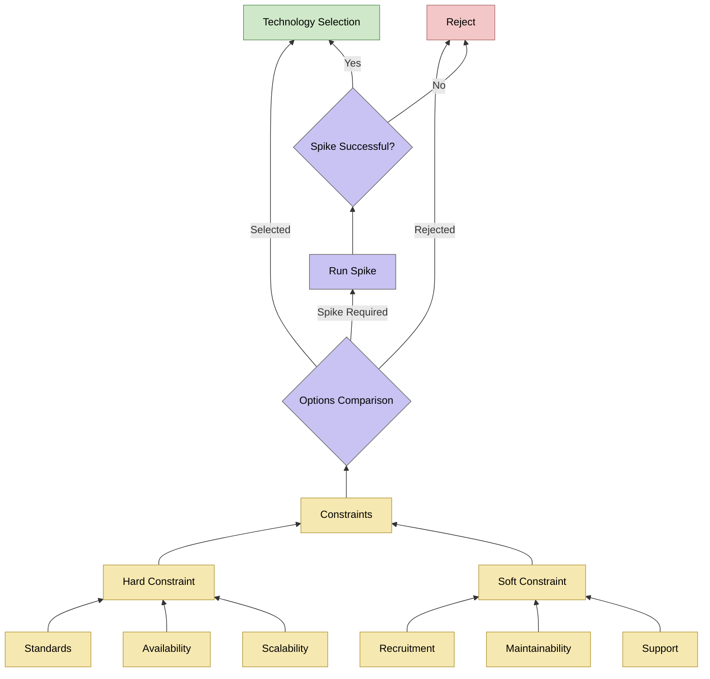

The decision-making process follows the flow shown below:

The "standards" hard constraint includes typical implementations with the wider DfE landscape, as well as GDS compliance, for example, the use of Azure is not a standard, but a hard constraint as the preferred cloud platform for the department.

## Recording Decisions

Significant decisions that impact the architecture, technology stack, or development patterns of the service are recorded as **Architectural Decision Records (ADRs)**. We use the [Markdown Architectural Decision Records (MADR)](https://adr.github.io/madr/) format to ensure these records are consistent, readable, and version-controlled alongside our code.

### When to Create an ADR

You should consider creating an ADR when a decision:

- Has multiple viable options with significant trade-offs.
- Is not immediately obvious from the code or infrastructure configuration.
- Is likely to be revisited or questioned by current or future team members.

### Process for New Decisions

1. **Identify the Need**: Recognize when a decision fits the criteria above.
2. **Draft the ADR**: Use the sequential naming convention (e.g., `NNNN-short-title.md`) and follow the MADR template.
3. **Review**: Discuss the proposal with the team, typically via a Pull Request.
4. **Finalize**: Once agreed upon, the ADR is merged and becomes an immutable record of that decision. If a decision is later superseded, a new ADR is created to document the change.

You can explore all significant decisions made during the development of this service on our [decisions page](/decisions/).