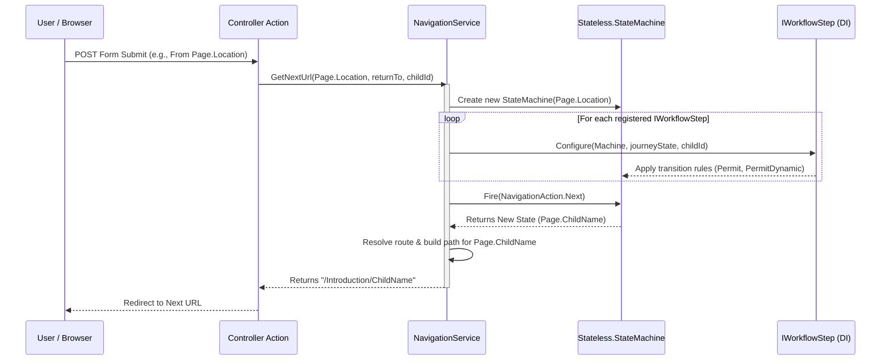

The user journey in the Accessing Childcare Entitlement Checker is a multi-step dynamic form. Because the application is fully stateless on the server, progress is maintained on the client side using session state. 

The flow through these pages is managed by a centralised Navigation Service which uses the Stateless library to construct a state machine dynamically on each request. This guide explains the architecture of the Navigation Service, how transitions are configured, and how to add or modify workflow steps.

## Architectural Overview

Unlike typical desktop applications where a state machine persists in memory, the web application runs in an ephemeral, stateless context. Every time a user submits a form or clicks a link:

1.  The browser sends the current state (implicitly, via the requested URL or routing params) and the collected data (in the form model, stored in the encrypted cookie).
2.  The application deserializes the user's progress into a `JourneyState` object.
3.  The `NavigationService` instantiates a brand new, lightweight `StateMachine<Page, NavigationAction>` initialized to the user's *current page*.
4.  The service registers all configured `IWorkflowStep` rules to set up the valid paths (transitions) for the current machine.
5.  The service fires the trigger (`Next` or `Back`).
6.  The state machine determines the *destination page* based on the registered transitions and the current answers.
7.  The service generates the corresponding ASP.NET Core MVC URL and returns it to the controller to perform a redirect.

### High-Level Request Lifecycle

The following sequence diagram shows how the state machine is initialised and executed dynamically on a single POST request:



## Core Components

The Navigation Service lives in the `AccessingChildcareEntitlementChecker.Web` project under `Services/Navigation/`.

### The States: `Page`
The `Page` enum represents the states of the machine. Every page/screen in the user journey maps to a single value in this enum:

```csharp
public enum Page
{
    Location,
    ChildName,
    IsChildBorn,
    ChildBirthDate,
    ChildRelationship,
    // ...
    CheckAnswers,
    Results
}
```

### The Triggers: `NavigationAction`
Transitions between pages are triggered by two main actions representing user intent:

```csharp
public enum NavigationAction
{
    Next,
    Back
}
```

### The Contract: `INavigationService`
Controllers interact with the service through the `INavigationService` interface:

```csharp
public interface INavigationService
{
    string GetNextUrl(Page currentPage, string? returnTo = null, string? childId = null);
    string GetBackUrl(Page currentPage, string? returnTo = null, string? childId = null);
}
```

-   `currentPage`: The state the user is currently on.
-   `returnTo`: Optional parameter used to return the user straight back to review/summary screens after editing an answer.
-   `childId`: Optional ID of the child currently being added or edited.


## Modular Workflow Steps

To keep the codebase maintainable and prevent a single gargantuan configuration file, the state transition rules are split into modular Workflow Step classes, each implementing the `IWorkflowStep` interface:

```csharp
public interface IWorkflowStep
{
    void Configure(StateMachine<Page, NavigationAction> machine, JourneyState state, string? childId);
}
```

All implementations are registered with the dependency injection container and injected into the `NavigationService` as an `IEnumerable<IWorkflowStep>`.

The existing steps are divided logically:

| Class                               | Scope of Responsibility                                                           |
|:------------------------------------|:----------------------------------------------------------------------------------|
| `HomeWorkflowSteps`                 | Initial entry pages (e.g., Location).                                             |
| `IntroductionWorkflowSteps`         | Basic child setup (e.g., Child Name, checking if they are born).                  |
| `BornChildDetailsWorkflowSteps`     | Follow-up questions for children already born (e.g., Birth Date, Child Support).  |
| `ExpectedChildDetailsWorkflowSteps` | Follow-up questions for expected children (e.g., Due Date, Relationship).         |
| `UserWorkflowSteps`                 | Demographic, residency, income, and benefit questions about the user.             |
| `PartnerWorkflowSteps`              | Questions about the partner's status, income, and benefits if applicable.         |
| `SummaryWorkflowSteps`              | Review pages (`CheckChildDetails` and `CheckAnswers`) and final results redirect. |


## Dynamic and Conditional Routing

Many transitions depend on previous answers. The `Stateless` library provides `PermitDynamic` to define state transitions evaluated at runtime using lambda expressions.

### Example: EU Settlement Check
In `UserWorkflowSteps.cs`, whether a user sees the `SettledStatus` page depends on their nationality:

```csharp
machine.Configure(Page.Nationality)
    .PermitDynamic(NavigationAction.Next, () => GetNationalityNextPage(state))
    .Permit(NavigationAction.Back, Page.UserAge);

// ...

private static Page GetNationalityNextPage(JourneyState state) =>
    state.Nationality == NationalityOption.CitizenOfAnEUCountryEEACountryOrSwitzerland
        ? Page.SettledStatus
        : Page.PaidWork;
```

### Example: Employment Status & Earnings
If a user indicates they are in paid work, we ask about their employment status. If they are self-employed, we also ask how long they have been self-employed. If they have been self-employed for less than 12 months, they bypass the weekly earnings threshold check entirely:

```csharp
machine.Configure(Page.WorkStatus)
    .PermitDynamic(NavigationAction.Next, () => GetWorkStatusNextPage(state))
    .Permit(NavigationAction.Back, Page.PaidWork);

machine.Configure(Page.SelfEmployedDuration)
    .PermitDynamic(NavigationAction.Next, () => GetSelfEmployedDurationNextPage(state))
    .Permit(NavigationAction.Back, Page.WorkStatus);

// ...

private static Page GetWorkStatusNextPage(JourneyState state) =>
    state.WorkStatus.Contains(WorkStatusOption.SelfEmployed)
        ? Page.SelfEmployedDuration
        : Page.WeeklyEarnings;

private static Page GetSelfEmployedDurationNextPage(JourneyState state) =>
    state.SelfEmployedDuration == SelfEmployedDurationOption.LessThan12Months
        ? Page.UniversalCredit
        : Page.WeeklyEarnings;
```

## Visualising the Flow Graph

The diagram below maps out the primary pathways and decision nodes in the workflow. Notice how the user's answers in `IsChildBorn`, `Nationality`, `PaidWork`, `WorkStatus`, `WeeklyEarnings`, `HasPartner`, etc., trigger branches in the graph.

```mermaid
flowchart TD
    Location((Location)) -->|Next| ChildName((Child Name))
    ChildName -->|Next| IsChildBorn{Is Child Born?}

    IsChildBorn -->|Yes: Born| ChildBirthDate((Child Birth Date))
    IsChildBorn -->|No: Expected| ChildDueDate((Child Due Date))

    ChildBirthDate -->|Next| ChildRelationship((Child Relationship))
    ChildRelationship -->|Next| ChildSupport((Child Support))
    ChildSupport -->|Next| CheckChildDetails((Check Child Details))

    ChildDueDate -->|Next| ExpectedChildRelationship((Expected Child Relationship))
    ExpectedChildRelationship -->|Next| CheckChildDetails

    CheckChildDetails -->|Next| UserAge((User Age))
    UserAge -->|Next| Nationality((Nationality))

    Nationality -->|EU Citizen| SettledStatus((Settled Status))
    Nationality -->|Other| PaidWork((Paid Work))
    SettledStatus -->|Next| PaidWork

    PaidWork -->|Yes| WorkStatus((Work Status))
    PaidWork -->|On Leave| TypeOfLeave((Type of Leave))
    PaidWork -->|No| UniversalCredit((Universal Credit))

    WorkStatus -->|Self Employed| SelfEmployedDuration((Self Employed Duration))
    WorkStatus -->|Employed / Both| WeeklyEarnings((Weekly Earnings))

    SelfEmployedDuration -->|Less than 12m| UniversalCredit
    SelfEmployedDuration -->|12m or more| WeeklyEarnings

    WeeklyEarnings -->|Above Threshold| YearlyEarnings((Yearly Earnings))
    WeeklyEarnings -->|Below / On Threshold| UniversalCredit

    YearlyEarnings -->|Above Threshold| Benefits((Benefits))
    YearlyEarnings -->|Below / On Threshold| UniversalCredit

    UniversalCredit -->|Next| Benefits
    Benefits -->|Next| ChildcareSupport((Childcare Support))

    ChildcareSupport -->|Has Vouchers| ChildcareVoucherReceipt((Childcare Voucher Receipt))
    ChildcareSupport -->|No Vouchers| HasPartner((Has Partner?))
    ChildcareVoucherReceipt -->|Next| HasPartner

    HasPartner -->|Yes| PartnerAge((Partner Age))
    HasPartner -->|No| CheckAnswers((Check Answers))

    PartnerAge -->|Next| PartnerNationality((Partner Nationality))
    PartnerNationality -->|EU Citizen| PartnerSettledStatus((Partner Settled Status))
    PartnerNationality -->|Other| PartnerPaidWork((Partner Paid Work))
    PartnerSettledStatus -->|Next| PartnerPaidWork

    PartnerPaidWork -->|Yes| PartnerWorkStatus((Partner Work Status))
    PartnerPaidWork -->|On Leave| PartnerTypeOfLeave((Partner Type of Leave))
    PartnerPaidWork -->|No| PartnerBenefits((Partner Benefits))

    PartnerWorkStatus -->|Self Employed| PartnerSelfEmployedDuration((Partner Self Employed Duration))
    PartnerWorkStatus -->|Employed / Both| PartnerWeeklyEarnings((Partner Weekly Earnings))

    PartnerSelfEmployedDuration -->|Less than 12m| PartnerBenefits
    PartnerSelfEmployedDuration -->|12m or more| PartnerWeeklyEarnings

    PartnerWeeklyEarnings -->|Above Threshold| PartnerYearlyEarnings((Partner Yearly Earnings))
    PartnerWeeklyEarnings -->|Below / On Threshold| PartnerBenefits

    PartnerYearlyEarnings -->|Next| PartnerBenefits

    PartnerBenefits -->|Next| PartnerChildcareSupport((Partner Childcare Support))

    PartnerChildcareSupport -->|Has Vouchers| PartnerChildcareVoucherReceipt((Partner Childcare Voucher Receipt))
    PartnerChildcareSupport -->|No Vouchers| CheckAnswers

    PartnerChildcareVoucherReceipt -->|Next| CheckAnswers
    CheckAnswers -->|Next| Results((Results))
```



## Special Behaviours

### Summary Bypass (`returnTo`)
When a user is on the final `CheckAnswers` or `CheckChildDetails` page, they can click "Change" next to any previously answered question. When they do, the controller appends a `returnTo` query parameter containing the destination review page.

To provide a smooth user experience, the navigation service bypasses normal state machine transition evaluation when `returnTo` is present:

```csharp
public string GetNextUrl(Page currentPage, string? returnTo = null, string? childId = null)
{
    switch (returnTo)
    {
        case Models.ReturnTo.CheckAnswers:
            return GetUrl(Page.CheckAnswers, childId: childId);
        case Models.ReturnTo.CheckChildDetails:
            return GetUrl(Page.CheckChildDetails, childId: childId);
    }

    var machine = BuildMachine(currentPage, childId);
    machine.Fire(NavigationAction.Next);
    return GetUrl(machine.State, returnTo, childId);
}
```

This guarantees that editing a value takes the user instantly back to the summary screen to save time.

### Back Path Safety
When navigating backward, the `NavigationService` verifies if a transition exists. If the user somehow navigates back from a state that does not have an explicit `Back` transition configured (such as the landing location page), the service handles it gracefully by routing the user back to the application's home page:

```csharp
var machine = BuildMachine(currentPage, childId);
if (!machine.CanFire(NavigationAction.Back))
{
    return "/";
}
```

## Route Resolution

The `NavigationService` defines a static dictionary mapping each `Page` enum value to its corresponding ASP.NET Core `Controller` and `Action`:

```csharp
private static readonly Dictionary<Page, (string Controller, string Action)> PageRoutes = new()
{
    { Page.Location, (HomeController, "Location") },
    { Page.ChildName, (IntroductionController, "ChildName") },
    { Page.IsChildBorn, (IntroductionController, "IsChildBorn") },
    // ...
};
```

When building URLs in the `GetUrl` method, the service:
1.  Retrieves the mapped controller and action.
2.  Adds query arguments (e.g., `childId`, `fromChildId`, `returnTo`) using a `RouteValueDictionary`.
3.  Invokes ASP.NET Core's `LinkGenerator.GetPathByAction` to generate a relative URL.

## Extending the Workflow

To add a new page or change a transition path:

1.  Add a Page Enum Entry: If introducing a new screen, add its representation to the `Page` enum in `Page.cs`.
2.  Add a Route Mapping: Register the new enum state and its corresponding controller/action in the `PageRoutes` dictionary in `NavigationService.cs`.
3.  Configure transitions in the relevant WorkflowStep:
    -   Locate or create the appropriate `IWorkflowStep` implementation under `Steps/`.
    -   If creating a new workflow step class, make sure it is registered in the DI container (typically registered automatically if utilizing assembly scanning or added manually in `ServiceCollectionExtensions.cs`).
    -   Define the transitions using `machine.Configure(...)` with `.Permit()` or `.PermitDynamic()`.
4.  Write Tests: Add unit tests in `NavigationServiceTests.cs` or specialised step test classes (e.g., `UserWorkflowStepsTests.cs`) to ensure the page routing operates precisely as intended under different state scenarios.
