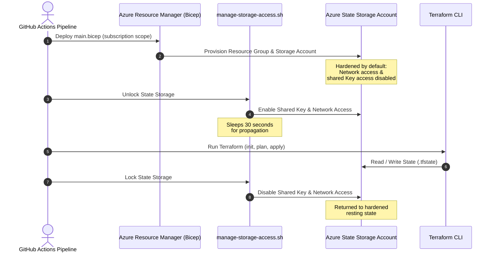

To manage infrastructure declaratively with Terraform, a remote backend is required to securely store state files (`.tfstate`) and coordinate state locking. However, this introduces a classic Day 0 "chicken-and-egg" problem:

* Terraform needs a remote backend (Azure Storage Account and Blob Container) to run.
* The remote backend cannot be managed by the same Terraform configuration that relies on it.

To solve this, this project implements a fully automated, declarative bootstrapping process using Azure Bicep and Azure CLI, which is seamlessly integrated into our deployment pipelines. 

This guide explains how the bootstrapping architecture works, how it is secured, how it is integrated into CI/CD, and how you can interact with it if necessary.

## Architecture Overview

We use Azure Bicep for provisioning the bootstrap infrastructure. The bootstrap phase runs before any Terraform execution. It is scoped at the Azure Subscription level, allowing Bicep to dynamically create or manage the target resource group and populate it with the state backend resources.

### Components Created

The bootstrap resources are defined in `infra/bicep/` and consist of:

1. Resource Group: Isolated specifically for managing state storage (e.g., `s279d01rg-uks-cec-terraform`).
2. Storage Account: Hosts the blob state. Hardened by default with:
   * Minimum TLS Version set to `TLS1_2`.
   * Secure transit only (`supportsHttpsTrafficOnly: true`).
   * Disabled Shared Key Access (`allowSharedKeyAccess: false`).
   * Disabled Public Network Access (`publicNetworkAccess: 'Disabled'`).
3. Blob Service & Container:
   * Versioning enabled on the blob service (`isVersioningEnabled: true`).
   * Soft-delete retention policies (14 days) enabled for both blobs and containers.
   * A private blob container named `tfstate`.
4. Log Analytics Workspace & Diagnostics:
   * A workspace dedicated to tracking operations (e.g., `279d01-uks-cec-law-tf-state`).
   * Diagnostic settings on the Storage Account's Blob Service sending logs (`StorageRead`, `StorageWrite`, `StorageDelete`) and transactions to the Log Analytics Workspace for security auditing.