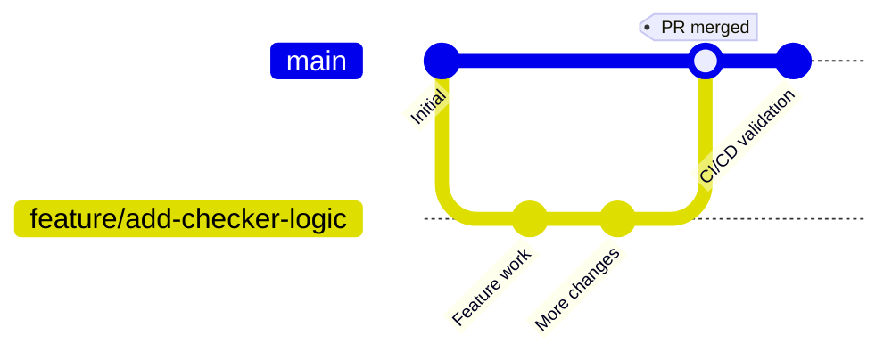
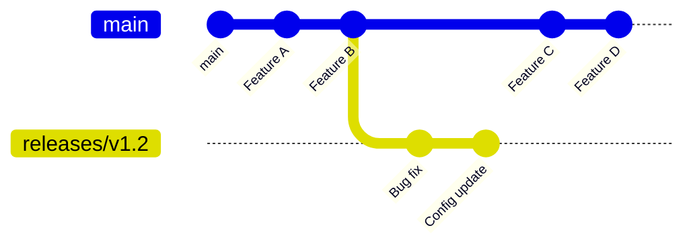
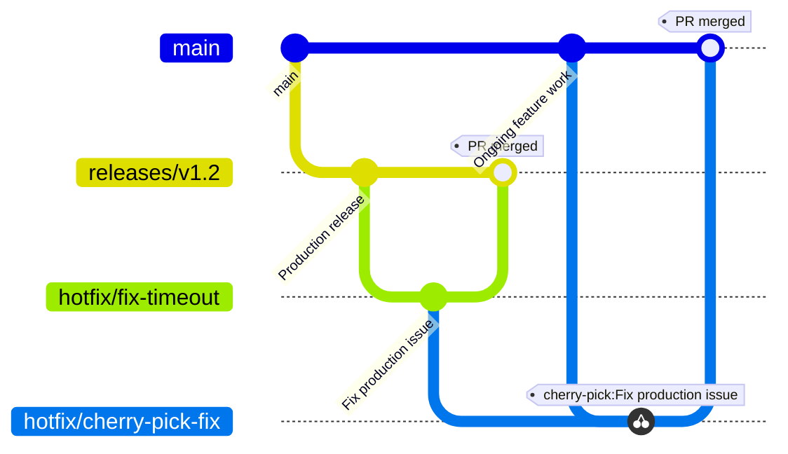

This guide explains the Git branching and release model for this project. Our strategy balances continuous delivery with low risk. We use a trunk-based model with structured release paths. Pull requests act as quality gates.

## Architectural goals

The branching and release model is structured around several core objectives:

* **Continuous Integration**: We keep integration fast and simple. This minimises merge conflicts and branch drift.
* **Continuous Delivery Readiness**: We make sure that the primary branch is always stable and ready to deploy.
* **Risk Mitigation**: We provide isolated pathways for safe staging, regression tests, and production validation.
* **Agility**: We support fast, low-risk hotfixes. This does not disrupt ongoing feature development.
* **Collaboration**: We make sure peers review all changes before they enter key environments. Automated gates also verify these changes.

## Key branch archetypes

### The Trunk (`main`)

The `main` branch is the central source of truth and the primary integration target.

* **The Principle of Continuous Deployability**: The `main` branch is the foundation for all releases. We treat this branch as continuously deployable. Automated CI/CD pipelines validate every change to protect the trunk.
* **Automated Environments**: Merges into the trunk automatically trigger deployments to Development and Test. This helps create fast feedback loops.
* **Integration Patterns**: Developers must merge small, frequent updates. They rebase often to stay aligned with the trunk. They avoid long-running feature branches and use pull requests as quality gates.

### Release branches (`releases/vX.Y`)

Release branches are stable snapshots of the codebase. We use these branches for staging and production validation.

**Naming Convention:**

```text
releases/vX.Y
```

* **Isolating the Release Lifecycle**: We separate the release branch from ongoing feature development. This separation makes sure the team can stabilize a release candidate. They do not need to pause work on the trunk.
* **Scope Control**: We do not add new features to release branches to keep them stable. We limit activity to bug fixes, critical configuration, documentation, version updates, and approved hotfixes. We introduce all changes through peer-reviewed pull requests.
* **Verification and Staging**: These branches help us perform User Acceptance Testing (UAT), accessibility reviews, and end-to-end regression tests in staging. This process builds a safe, verified path to production.

## Execution workflows

### Feature development and integration



The integration process makes sure we verify single features before we merge them.

* **Branching from Trunk**: We start feature work on a short-lived branch. We create this branch from the trunk.
* **Verification Gates**: Opening a pull request triggers the CI pipeline. The pipeline runs builds, linter checks, and automated test suites.
* **Trunk Integration**: After we approve and verify the changes, we merge them into the trunk. This merge triggers automatic deployments to Development and Test for broader testing.

### Release stabilisation and deployment



The release workflow manages the movement of stable code from the trunk to production.

* **Branch Creation**: We create a release candidate by cutting a `releases/vX.Y` branch from the trunk.
* **Staging and Hardening**: We deploy the release candidate to the Staging environment. Here, we run exhaustive tests. These include automated end-to-end user journey tests, accessibility tests, regression suites, and User Acceptance Testing (UAT) sign-off.
* **Production Delivery**: After we validate the release, we promote the stable release branch to Production.

We document the detailed procedures, approval matrices, and communication templates in the [Release Process](/how-to/release-process/) guide.

### Hotfix coordination



When we find critical issues in production, we use a hotfix flow. This flow helps the team apply targeted fixes safely. It does not disrupt the main development pipeline.

* **Targeted Remediation**: We create a hotfix branch directly from the active release branch (`releases/vX.Y`). This makes sure we only introduce the critical fix.
* **Dual Integration**:
  1. **Release Branch Integration**: We merge the fix into the release branch using a pull request. The change passes CI/CD validation. We then deploy it to Staging and Production.
  2. **Trunk Integration (Backporting)**: We backport or cherry-pick the fix into a branch targeting `main`. This prevents regressions in future releases. We merge the branch using the standard pull request process.

## Repository safeguards

We enforce strict branch protection policies on `main` and all `releases/*` branches to keep their integrity high. These settings act as programmatic guardrails to make sure we keep high quality:

* **Mandatory Peer Review**: We disable direct pushes. All changes must go through peer-reviewed pull requests.
* **Automated Quality Gates**: Status checks, builds, and test suites must pass in the CI environment before we merge code.
* **Linear History**: We keep clean, traceable histories by enforcing squash-and-merge or rebase policies. This eliminates complex merge commits.
* **Formal Approval**: Only pull requests with the required maintainer approvals can merge.
