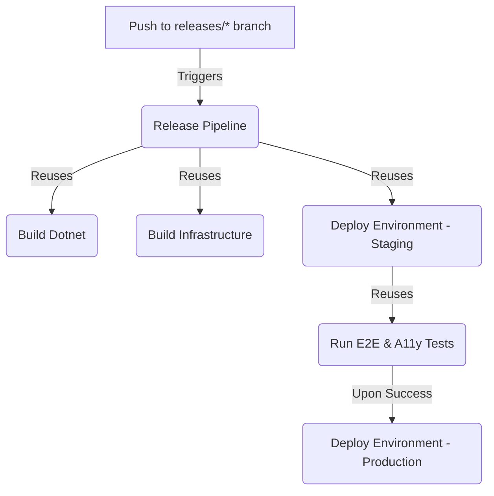

This guide explains the design and philosophy of the project CI/CD pipelines. Knowing these systems makes sure deployments stay automated, safe, and uniform across all environments.

## Event-driven automation philosophy

We build CI/CD pipelines around a push-based automation model. We do not use manual triggers like `workflow_dispatch` to deploy releases.

- **Immutable History**: We connect deployments to git events like pushes to `main` or release branches. This connection makes sure we keep a 1:1 map between source control and the cloud.
- **Guaranteed Consistency**: Automated workflows run all deployments instead of manual CLI commands. This process makes sure that we run the same build, lint, and validation steps every time.
- **No Manual Drift**: We restrict manual triggers. This restriction removes the risk of configuration drift or untested code reaching our environments.

## Pipeline structure and reusability

We structure our GitHub Actions workflows into reusable blocks using `workflow_call`. This separation of concerns helps us keep clean pipelines. We can also reuse deployment logic safely.

### 1. Reusable Deployments (`deploy-environment.yml`)
The `deploy-environment.yml` workflow manages the deployment lifecycle for a single environment. It accepts the target environment name as input and resolves variables:
- We set up Terraform state storage using Bicep.
- We set up Terraform and apply configurations.
- We deploy the application package using `az webapp deploy`.

The Main Integration pipeline and the Release pipeline both call this single workflow. This makes sure deployment steps never drift between lower and production environments.

### 2. Automated Promotion Quality Gates
Automated gates protect deployments to production and other high-risk environments. For example, in the Release pipeline:
- We deploy the application to Staging first.
- We run automated Playwright E2E and accessibility tests against the Staging URL.
- The pipeline proceeds to Production only if all tests pass.
- After a successful deployment, we build the release package and upload it as a stable GitHub Release.
