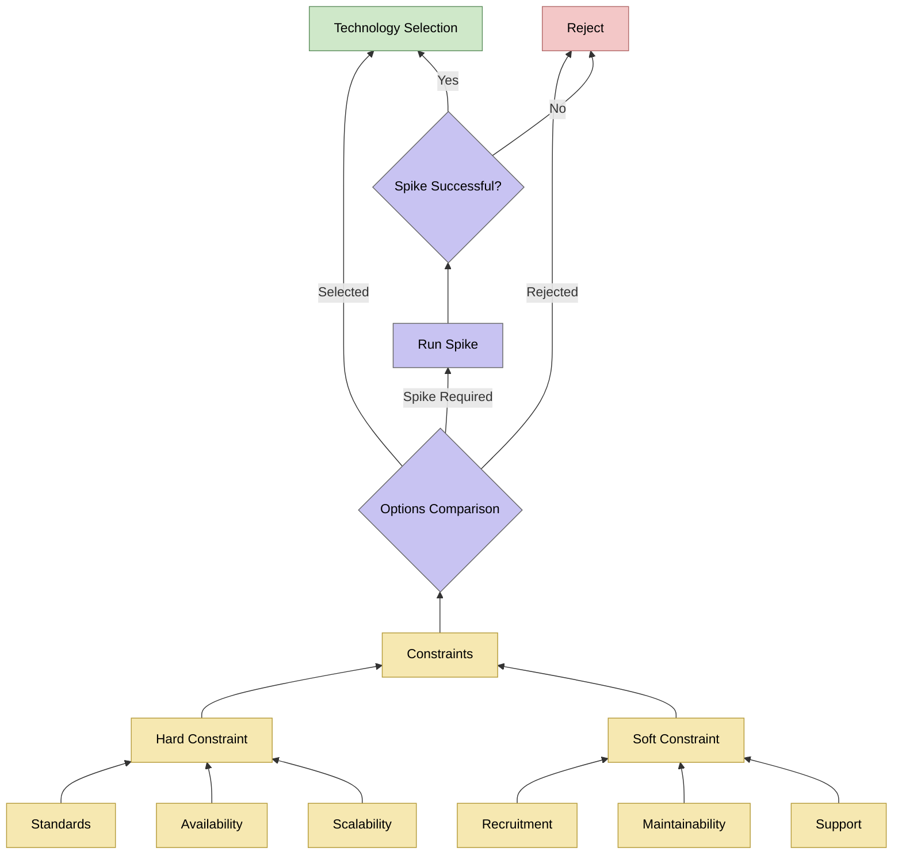

This guide explains how we make and record architectural decisions for this project. Grounding decisions in clear constraints and history makes sure the system stays scalable, secure, and maintainable.

## Decision-making and constraints framework

The engineering team evaluates choices using a structured framework. This framework separates hard constraints from soft constraints. It balances technical requirements with department standards.

We use a defined decision flow to evaluate and select technology:

* **Hard Constraints**: These requirements are non-negotiable. They include Department for Education (DfE) technical standards, Service Assessment (GDS) compliance, and cloud platforms. For example, we use Azure because of department standards. We also evaluate availability and scalability targets here.
* **Soft Constraints**: These are architectural preferences and operational goals. They include recruitment, long-term maintainability, and support structures.

## Architectural decision records (ADRs)

We keep the reasons for our technical choices in Architectural Decision Records (ADRs). These records cover system architecture, technology stacks, or key patterns. We use the [Markdown Architectural Decision Records (MADR)](https://adr.github.io/madr/) format. This format makes sure the records are readable, consistent, and version-controlled alongside our source code.

### Decision record criteria
We write a decision record when a choice:
* Has multiple options with important trade-offs.
* Introduces non-obvious code patterns or infrastructure setups.
* Represents a key design choice that future team members might question or audit.

### Decision recording lifecycle
We base our decision process on team reviews and permanent records:

* **Identification**: We identify when a technical choice needs a formal record.
* **Drafting**: We write a new record using the standard MADR template. We assign a sequential number prefix, like `NNNN-short-title.md`.
* **Collaborative Review**: We share the proposed record with the team in a Pull Request. We discuss trade-offs, assumptions, and options.
* **Finalization**: We merge the approved record into the main repository. Here, it stays as a permanent point-in-time record. If we change a decision later, we write a new ADR. This new ADR replaces the old one. We do not edit historical entries.

You can read all past decisions on our [decisions page](/reference/decisions/).
