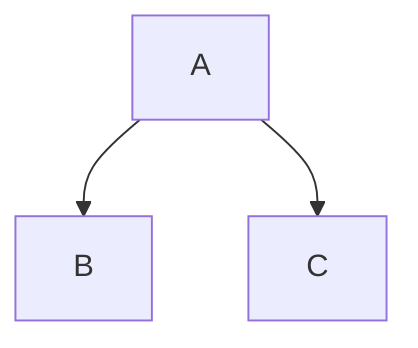

This guide explains the technical design and publishing process for our documentation. The documentation platform runs as a static site. It connects with development workflows to keep an accessible, version-controlled repository of technical knowledge.

## Local preview environment

The documentation site uses [Eleventy](https://www.11ty.dev/) and the [X-GOVUK plugin](https://x-govuk.github.io/govuk-eleventy-plugin/). To support writing and updates, a local preview server compiles Markdown files into styled, DfE-branded HTML pages in real time.

To preview changes:
* Go to the repository root directory.
* Start the Eleventy development server using `make docs-s`. This automatically handles installation and setup.
* Open `http://localhost:8080/` in a local browser to see the site.

*Friendly tip: To start this local server and create your first page step-by-step, read our [Writing documentation tutorial](/tutorials/writing-documentation/).*

## Content organisation and structure

We organise documents into logical directories. These directories match the **Diátaxis documentation framework**:

| Category | Path | Tone | Purpose |
| :--- | :--- | :--- | :--- |
| **Tutorials** | `docs/content/tutorials/` | Friendly and conversational | Guided, hands-on learning for newcomers. We focus on setting up and starting with the project. |
| **How-to Guides** | `docs/content/how-to/` | Action-driven and direct | Step-by-step instructions to solve specific, immediate tasks or runbooks. |
| **Explanation** | `docs/content/explanation/` | Concept and context | Deep dives into architectural designs, philosophies, and branching strategies. We help you build a robust mental model. |
| **Reference** | `docs/content/reference/` | Factual and objective | Technical specs, ADRs, network topologies, and alerts. We use objective, third-person phrasing without pronouns. |

All future documentation and updates must follow these tone and style guidelines. This keeps the files clear, predictable, and easy to use.

### Metadata and routing (front matter)
The documentation engine uses YAML front matter at the top of each Markdown file. This front matter defines the page title, sets up navigation structures, and registers the file with Eleventy:

```markdown
---
title: My New Page Title
eleventyNavigation:
  key: My Page Key
---
```

> [!TIP]
> **Note**: We resolve the site layout, navigation, and section keys automatically from the directory structure. You do not need to define layout parameters in single pages.

## Diagrams (Mermaid integration)

We show technical architecture and data flows using [Mermaid](https://mermaid.js.org/) syntax inside Markdown code blocks:



The rendering pipeline parses these code blocks. It applies custom DfE branding and responsive layouts to make sure we keep visual consistency.

## Publishing pipeline

We integrate the documentation site with the repository source control.
* **Continuous Integration**: Pushes and updates to pull requests start automated build checks. These checks verify formatting, links, and compilation integrity.
* **Continuous Deployment**: Merges into `main` trigger an automated deployment. The pipeline rebuilds and publishes the content to GitHub Pages. This process makes sure documentation stays synchronized with the code.
