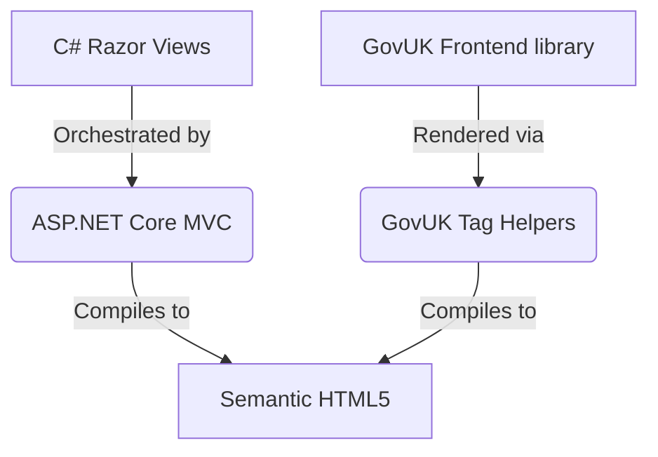

This guide explains the design principles and patterns of the Web application frontend. Knowing these concepts makes sure the user interface stays accessible, maintainable, and aligned with Department for Education (DfE) styles.

## Progressive enhancement philosophy

We build the frontend architecture using a server-side rendered (SSR), progressive-enhancement model. We do not use heavy client-side Single Page Application (SPA) frameworks like React, Angular, or Vue. Instead, we use lightweight, resilient HTML.

- **Accessibility First**: We build the entire page structure on the server. The application stays fully functional for users who use screen readers, have slow connections, or turn off client-side JavaScript.
- **Robust Performance**: Server-side rendering reduces the "Time to Interactive" on mobile devices. The browser does not need to download and compile large JavaScript files before showing the interface.
- **Resilient Validation**: We validate form inputs on the server using C# data annotations and model binding. This makes sure that users cannot bypass or change validation rules in the browser.

## Tech stack integration

We build the frontend using three closely integrated parts:



### 1. ASP.NET Core MVC
The application uses the standard Model-View-Controller pattern. Controllers manage the data flow. They map session state to view models and pass them to Razor Views.

### 2. GovUK Design System & DfE styling
To make sure we follow visual consistency and government service standards, the user interface uses the **GovUK Frontend** library. We customise this library with DfE (Department for Education) themes. This styling provides the fonts, form elements, buttons, and layout grids.

### 3. GovUK Tag Helpers
To simplify view creation and avoid repeating boilerplate HTML, the project uses the `GovUk.Frontend.AspNetCore` library. This helps developers write complex GovUK design patterns using custom tags in Razor templates:

```html
<govuk-button href="/next-step">
    Continue
</govuk-button>
```

The rendering engine parses these tags when it compiles requests. It changes them into accessible, compliant GovUK HTML structures. These structures contain the correct classes, ARIA roles, and responsive layouts before we serve them to the user.
