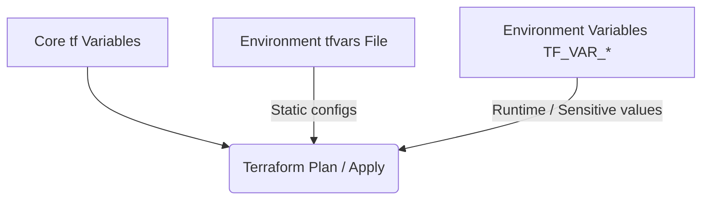

This guide explains the architectural design, variable setups, and security scans for our infrastructure codebase. Knowing these systems makes sure that changes to our cloud environment stay stable, secure, and predictable.

## Architectural structure

We provision cloud resources on Azure using Terraform. Instead of combining all configurations into a single file, we separate the code into logical files. This makes sure we keep the code readable and easy to own.

### Folder structure
The main infrastructure folders are:
- `infra/terraform/`: This folder has core resource declarations. These include App Service, Azure Front Door, Redis, and Web Application Firewall.
- `infra/terraform/environments/`: This folder has environment parameters. These cover Development, Staging, and Production.
- `infra/bicep/`: This folder contains Bicep files used exclusively for bootstrapping the initial Terraform state. For more details on when and how this is used, see the [Terraform bootstrap
  guide](/how-to/terraform-bootstrap) and the [bootstrap decision record](/reference/decisions/bootstrap-tf).

### Core file responsibilities
In the Terraform directory, each file covers a single conceptual layer:
- `frontdoor.tf` and `frontdoor_waf.tf`: We manage public routing, custom domains, and security firewalls here.
- `web.tf`: We configure the main Linux App Service, scale tiers, and slot setups here.
- `redis.tf` and `law.tf`: We configure state caching and log monitoring workspaces here.
- `locals.tf` and `variables.tf`: We store global calculations, naming conventions, and parameter declarations here.

## Blended variable configuration

To support flexible and secure deployments, the system uses a blended configuration model. This model combines static environment files (`.tfvars` files) with sensitive values that we inject at runtime using environment variables.

### Static environment values (`.tfvars` files)
Each environment has its own parameter file in `infra/terraform/environments/`, like `production.tfvars`. These files store non-sensitive settings that change by deployment target:
- Scale tiers, like standard vs. premium SKUs.
- Enabled features, like staging slots or alerts.
- Resource counts.

### Dynamic sensitive values (`TF_VAR_` environment variables)
We never write credentials, API keys, or secrets in the code. Instead, we define them in `variables.tf`. We fill them at runtime during the CI/CD pipeline using environment variables with the `TF_VAR_` prefix:
- `TF_VAR_development_basic_auth_password`
- `TF_VAR_redis_cache_connection_string`

This blending lets core files stay public and auditable in version control. It also protects environment and operational secrets from exposure.

## Security scanning and compliance

To protect the cloud perimeter, we must verify that resource configurations follow security best practices before we deploy. 

We use **Checkov** as our main tool to scan Terraform files. The system runs Checkov automatically in pull request validation workflows.

### Policy enforcement via Checkov
Checkov analyses resource configurations against a baseline of cloud security standards.

- **Custom Policies**: To follow Department for Education (DfE) standards, we use a custom Docker image from [dfe-digital/dfe-checkov-policies](https://github.com/dfe-digital/dfe-checkov-policies).
- **Quality Gates**: We put the security scan directly into the CI/CD pull request pipeline. The pipeline blocks merges if the code has a high-severity policy violation.

*Friendly tip: To learn how to edit and verify Terraform files locally, read our [Making infrastructure changes tutorial](/tutorials/making-infrastructure-changes/).*
