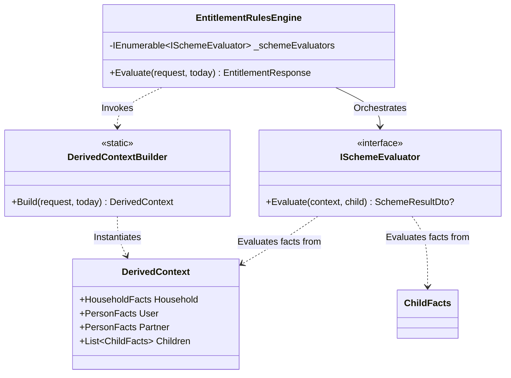

This guide explains the design and architecture of the `AccessingChildcareEntitlementChecker.RulesEngine` project. It describes how the system evaluates and extends childcare entitlement schemes.

## Overview

The Rules Engine is a pure C# class library. It has no web, database, or state-handling dependencies. The engine uses a deterministic input-output model:
1. It receives an `EntitlementRequest` DTO with raw user inputs like household details, parents, and children.
2. It maps and enriches these raw inputs into a structured context of business-centric Facts.
3. It loops through registered Scheme Evaluators (rules).
4. It returns an `EntitlementResponse` DTO that shows current and future eligibility for each child.

## Architectural design

To keep a clean separation of concerns and high extensibility, the Rules Engine uses three primary design patterns.



### The strategy pattern (rules evaluation)
The core evaluation architecture uses the GoF Strategy Pattern.

* The Strategy Interface (`ISchemeEvaluator`): This interface defines a common contract to evaluate a childcare scheme.
  ```csharp
  public interface ISchemeEvaluator
  {
      SchemeResultDto? Evaluate(DerivedContext context, ChildFacts child);
  }
  ```
* Concrete Strategies: We model each childcare scheme as a single class that implements `ISchemeEvaluator`. Examples include Tax-Free Childcare or 15 Hours Universal.
* The Strategy Context (`EntitlementRulesEngine`): This class runs the loop. It receives an `IEnumerable<ISchemeEvaluator>` using Dependency Injection (DI). It runs the evaluators one by one.

#### Benefits
* Open-Closed Principle (OCP): We do not need to change `EntitlementRulesEngine` when we add a new childcare scheme. You write a new class that implements `ISchemeEvaluator` and register it in DI.
* Separation of Concerns: Each evaluator handles its own eligibility rules. This keeps code files small, highly readable, and easy to test.

### The fact / specification pattern (logical abstraction)
Instead of running complex business logic on transport objects (`EntitlementRequest`), the engine converts inputs into semantic Facts. These Facts include:
* `DerivedContext`: Holds all consolidated facts for a single evaluation run.
* `HouseholdFacts`: Holds derived facts about the home, like whether they live in Great Britain.
* `PersonFacts`: Holds derived facts about a parent or partner, like whether they earn above the threshold.
* `ChildFacts`: Holds derived facts about a child, like age in years and months.

#### Benefits
* Decoupled Evaluation Logic: We protect evaluators from changes to the raw request DTO schemas. If the API payload changes, we only update the mapping layer.
* Readable Business Rules: Rules read like natural English regulatory policies. For example, `child.AgeInYears is >= 3 and <= 4` is easier to read than complex date math.

### Data mapper / static factory (context construction)
The `DerivedContextBuilder` acts as a static factory. It contains the logic to convert raw DTO inputs into business-centric Facts. 

* State Model: It exposes a single static mapping method: `DerivedContextBuilder.Build(request, today)`.
* Data Enrichment: The builder enriches the data beyond simple copying. For instance, it checks access to public funds using nationality and visa status.

## Technical naming conventions

The Rules Engine follows strict naming conventions to match its patterns:

1. Concrete Strategy Evaluators: These always end with `Evaluator`, like `TaxFreeChildcareEvaluator`.
2. Logical Fact Models: These always end with `Facts`, like `HouseholdFacts`. This separates them from transport DTOs or entity models.
3. Data Transport Objects: These always end with `Dto`, like `ChildDto`. This clearly shows network or boundary models.

## Evaluator principles

Several architectural principles guide the design of scheme evaluators. These principles make sure we keep long-term maintainability, testability, and correctness:

* **Isolation and Independence**: Each evaluator runs in isolation. It has no knowledge of or dependency on other evaluators. This independence makes sure we can add, change, or remove schemes without side effects.
* **Orchestration Separation**: Evaluators are pure strategy classes. They do not run other evaluators. The orchestration engine has sole responsibility to run single schemes.
* **Immutability of Context**: We treat the `DerivedContext` and `ChildFacts` objects as read-only. This prevents evaluators from changing state. It also makes sure we get predictable performance and avoids order dependencies.
* **Determinism**: For any input context, an evaluator always produces the same output. This makes the system deterministic, highly predictable, and easy to verify.
* **Fact-Based Evaluation**: Evaluators use semantic facts instead of raw request DTOs. This separation protects the core business logic from transport changes.

## Scheme extension lifecycle

We follow a defined process to extend the Rules Engine for a new childcare scheme. Instead of changing the core engine, we integrate new schemes using a few steps. We declare metadata, write the evaluation strategy, register the strategy in DI, and verify the code using unit tests.

### 1. Declaring the scheme code
The system identifies different childcare schemes using a central enumeration. To add a new scheme, we write its identity in the `SchemeCode` enumeration:

```csharp
public enum SchemeCode
{
    // Existing schemes...
    NewEntitlementScheme
}
```

### 2. Implementing the evaluator strategy
We write a new evaluator as a single, stateless strategy class that implements the `ISchemeEvaluator` interface. This class holds the regulatory rules and maps facts to a deterministic result:

```csharp
using AccessingChildcareEntitlementChecker.RulesEngine.Derived;
using AccessingChildcareEntitlementChecker.RulesEngine.Dtos.Responses;
using AccessingChildcareEntitlementChecker.RulesEngine.Evaluators;
using AccessingChildcareEntitlementChecker.RulesEngine.Types;

namespace AccessingChildcareEntitlementChecker.RulesEngine.Schemes;

public class NewEntitlementSchemeEvaluator : ISchemeEvaluator
{
    private const int MinimumEligibleAge = 2;

    public SchemeResultDto? Evaluate(DerivedContext context, ChildFacts child)
    {
        // 1. Assert household and individual requirements
        var eligibleNow = 
            context.Household.CountryOfResidence == CountryOfResidence.England &&
            child.IsBorn &&
            child.AgeInYears >= MinimumEligibleAge;

        var eligibleInFuture = 
            context.Household.CountryOfResidence == CountryOfResidence.England &&
            !child.IsBorn;

        // 2. Return null if absolutely ineligible now and in the future
        if (!eligibleNow && !eligibleInFuture)
        {
            return null;
        }

        // 3. Return the result
        return new SchemeResultDto
        {
            SchemeCode = SchemeCode.NewEntitlementScheme,
            EligibleNow = eligibleNow,
            EligibleInFuture = eligibleInFuture
        };
    }
}
```

### 3. Strategy registration and orchestrator integration
We register the class in the service collection. The orchestrator (`EntitlementRulesEngine`) resolves all registered `ISchemeEvaluator` classes. This lets the engine run the new strategy automatically without changes to its internal execution flow:

```csharp
public static IServiceCollection AddRulesEngine(this IServiceCollection services)
{
    services.AddScoped<EntitlementRulesEngine>();

    // Register Scheme Evaluators
    services.AddScoped<ISchemeEvaluator, UniversalCreditChildcareEvaluator>();
    services.AddScoped<ISchemeEvaluator, FifteenHoursUniversalEvaluator>();
    services.AddScoped<ISchemeEvaluator, TaxFreeChildcareEvaluator>();
    services.AddScoped<ISchemeEvaluator, ThirtyHoursForWorkingFamiliesEvaluator>();
    services.AddScoped<ISchemeEvaluator, FifteenHoursForDisadvantagedChildrenEvaluator>();
    services.AddScoped<ISchemeEvaluator, NewEntitlementSchemeEvaluator>(); // <-- Explicit registration of the new evaluator

    return services;
}
```

### 4. Behaviour verification
To make sure the new rules are safe and correct, we write comprehensive unit tests. These tests run the evaluator strategy against different facts to verify that results map correctly to regulatory requirements.

*Friendly tip: To create and test a new scheme in the codebase, read our [Adding a childcare scheme tutorial](/tutorials/adding-a-childcare-scheme/).*

## Testing patterns & doubles

We test the orchestrator (`EntitlementRulesEngine`) in isolation from real policy rules using the Test Fakes pattern instead of complex mocking frameworks. This keeps orchestrator unit tests fast, deterministic, and decoupled from external configurations.

In the test suite, we write two lightweight in-memory fake strategies to simulate different evaluation outcomes:

```csharp
private class FakeEligibleSchemeEvaluator : ISchemeEvaluator
{
    public SchemeResultDto? Evaluate(DerivedContext context, ChildFacts child)
    {
        return new SchemeResultDto { SchemeCode = SchemeCode.UniversalCreditChildcare, EligibleNow = true };
    }
}

private class FakeIneligibleSchemeEvaluator : ISchemeEvaluator
{
    public SchemeResultDto? Evaluate(DerivedContext context, ChildFacts child)
    {
        return null;
    }
}
```
This keeps orchestrator unit tests fast, deterministic, and free of dependency configuration.
