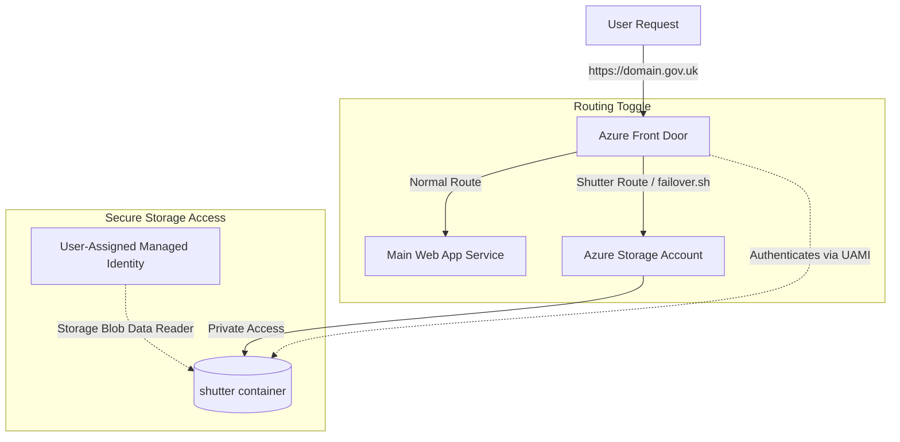

This guide explains the architectural design, security logic, and file management for our static shutter service. Knowing this system helps to make sure we gracefully degrade our application during maintenance or critical outages.

## Purpose of the shutter service

The shutter service provides graceful degradation and security resilience when the main application is offline. 

We can shutter the application during:

- Planned maintenance windows.
- Critical database or regional cloud infrastructure outages.
- Severe application-level system degradation.

### User experience and trust

In high-availability public government services, we must never show users raw web server errors (such as `502 Bad Gateway` or default IIS/Kestrel error pages). Default errors decrease user trust and do not offer helpful guidance. 

The shutter service displays a secure, static page that follows the trusted GOV.UK look, feel, and branding. It provides contact information so users know how to get assistance during the outage.

### Dangling DNS and subdomain takeover mitigation

The shutter service provides a vital security function by preventing "dangling DNS" vulnerabilities. 

- **The Risk**: If we temporarily disable or delete the backend App Service during a critical outage or migration, our public DNS records (and custom domains) will point to a non-existent Azure resource. An attacker could potentially register a new App Service with the same name in their own Azure subscription, taking over our subdomain (subdomain takeover).
- **The Mitigation**: By using Azure Front Door as a persistent global entry point and routing custom domains to a secure, long-lived Azure Storage Account instead of deleting DNS records, we ensure our subdomains always point to a resource under our control. The shutter storage account remains active and serves the "Service Unavailable" page, preventing any dangling DNS exploit.

## Architectural design

The shutter service uses a low-cost, secure architecture. It blocks public anonymous access and relies on Azure Active Directory (Entra ID) for authentication.

The service integrates three core components:

### 1. Locked-down Azure Storage Account

We provision an `azurerm_storage_account` and disable shared access keys (`shared_access_key_enabled = false`) and public anonymous access (`allow_nested_items_to_be_public = false`). The files are stored in a private container named `shutter`.

### 2. User-Assigned Managed Identity

We assign a dedicated User-Assigned Managed Identity (`frontdoor_identity`) to the Azure Front Door Profile. We grant this identity the `Storage Blob Data Reader` role on our storage account. This ensures only Azure Front Door is authorized to read the shutter page content.

### 3. Front Door routing and URL rewriting

- **Normal Operation**: Azure Front Door routes all traffic (`/*`) to the main Web App App Service using the `SecurityRules` rule set.
- **Shutter Operation**: Using our `failover.sh` runbook script, we update the route to point to the `shutter-origin-group` and attach both `SecurityRules` and `ShutterRules` rule sets.
- **Path Rewriting**: The `ShutterRules` rule set applies a `url_rewrite` rule. This rule rewrites any requested path (e.g. `/about` or `/help`) to `/index.html` before requesting the file from the blob origin. This ensures the user stays on their requested URL in their address bar but receives the "Service Unavailable" page, while still keeping critical security redirect paths (like `/security.txt` from `SecurityRules`) operational.

## Managing shutter content like code

The shutter page content is managed strictly as source code rather than being modified ad-hoc in the cloud console. 

The shutter files reside in the repository under:
`src/AccessingChildcareEntitlementChecker.Shutter/`

This code-first model provides several benefits:

### Governance and peer review

Any changes to the shutter page wording, help contacts, or design system assets must follow our standard pull request workflow. This guarantees that all changes are peer-reviewed, tested, and tracked in version control history.

### Automated packaging

A separate GitHub Actions workflow (`build-shutter.yml`) checks out the shutter directory and packages it into a zip file (`shutter-content`). This workflow runs in parallel with the main .NET application build, and the compiled zip file is attached to official GitHub releases.

### Continuous deployment

Our deployment pipeline (`deploy-environment.yml`) downloads the shutter artifact and securely uploads it to the storage account container using the Azure CLI. This ensures that every environment always has the latest approved static assets ready for immediate routing toggle.
