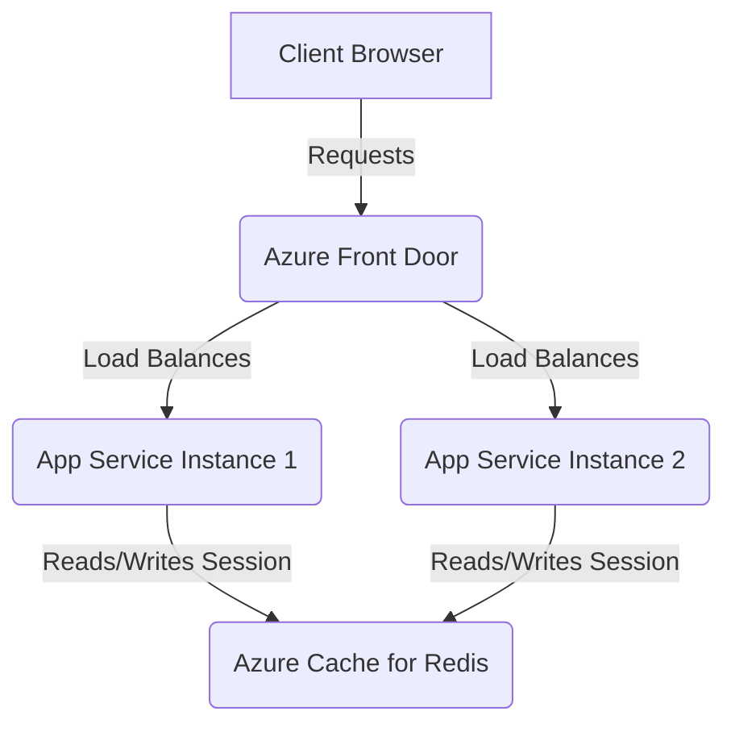

This guide explains the design and patterns of session state persistence in our Web application. Knowing these systems makes sure session state stays robust, secure, and performant.

## Ephemeral session philosophy

The application uses an ephemeral state philosophy. We do not use a persistent, relational database to store user data.

- **Zero-PII Footprint**: We collect personal data, evaluate it, and discard it immediately. This removes the risks of long-term data storage and reduces the security footprint.
- **Simplifying Recovery**: We do not have a master database. Therefore, we do not need replication, database failover procedures, or data reconciliation during cloud outages.
- **Journey-Only State**: We only keep the active user journey (form fields that the user completes). If we lose a session due to an outage, the user must restart their journey.

## Distributed session architecture

We manage user journeys across multiple, load-balanced web server instances. We do not bind users to a single server. Instead, we use a distributed session model.



### 1. ASP.NET Core session middleware
The application uses standard ASP.NET Core session state. When a user starts their journey, the middleware generates a unique, secure session ID. The system stores this ID in a transient cookie.

### 2. Distributed Redis cache
In Staging and Production, an **Azure Cache for Redis** instance backs the session state.
- When any App Service instance receives a request, the application uses the session ID cookie. It retrieves the user's current state from Redis.
- We separate the state from the web servers. This lets us add, remove, restart, or swap single web instances without interrupting the user.

### 3. Graceful local fallback
To keep local development fast, simple, and separate from Azure, the system falls back to an in-memory cache if Redis is not present:

```csharp
var redisConnection = configuration["RedisConnection"];

if (string.IsNullOrWhiteSpace(redisConnection))
{
    // Falls back to fast local memory for local development
    services.AddDistributedMemoryCache();
    return services;
}

// Configures the Azure-backed distributed Redis cache
services.AddStackExchangeRedisCache(_ => { });
```

## Security and encryption

To protect active sessions and prevent session hijacking or tampering:
- **HttpOnly Cookies**: We set session ID cookies to `HttpOnly`. This prevents client-side scripts like JavaScript from accessing them. This reduces Cross-Site Scripting (XSS) risks.
- **Secure Transport**: In Staging and Production, we set the `Secure` flag on session cookies. This makes sure cookies only travel over encrypted HTTPS connections.
- **Encrypted Cache**: We encrypt active session data in the Redis cache. We also use Azure-managed service identities to protect this data.
