This guide explains the user service flow for the Accessing Childcare Entitlement Checker. It provides business users with a conceptual overview of the paths that a user takes through the system to determine childcare eligibility.

## Service flow overview

The service evaluates a household's eligibility for different childcare entitlement schemes. To achieve this, the service collects data about:
1. The location of the household.
2. The children in the household.
3. The primary user's employment and financial status.
4. The partner's employment and financial status (if applicable).

The system uses conditional branching logic. The questions we show to a user depend entirely on their previous answers. This ensures that the user only answers questions that are relevant to their situation.

## Navigation path

The flowchart below shows the navigation path through the checker. It highlights the major decision points and branching logic.

```mermaid
flowchart TD
    Start([Start]) --> Location[Select location]
    
    Location --> ChildName[Enter child's name]
    ChildName --> ChildBorn{Is child born yet?}
    
    ChildBorn -- Yes --> ChildBirthDate[Enter birth date]
    ChildBirthDate --> ChildSupport[Enter child support details]
    ChildSupport --> CheckChildren[Check children's details summary]
    
    ChildBorn -- No --> ChildDueDate[Enter due date]
    ChildDueDate --> CheckChildren
    
    CheckChildren --> AddChild{Add another child?}
    AddChild -- Yes --> ChildName
    AddChild -- No --> UserAge[Enter user's age]
    
    UserAge --> UserNationality[Enter user's nationality]
    UserNationality --> UserEU{Is user an EU, EEA, or Swiss citizen?}
    
    UserEU -- Yes --> UserSettled[Enter settled status]
    UserEU -- No --> UserPaidWork
    UserSettled --> UserPaidWork
    
    UserPaidWork{Is user in paid work?}
    
    UserPaidWork -- Yes or Parental Leave or Sick Leave --> UserWorkStatus[Enter work status]
    UserPaidWork -- No --> UserUC[Enter Universal Credit details]
    
    UserWorkStatus --> UserSelfEmployed{Is user self-employed?}
    UserSelfEmployed -- Yes --> UserSEDuration{Has been self-employed < 12 months?}
    UserSelfEmployed -- No --> UserParentalLeave{On parental/sick leave?}
    
    UserSEDuration -- Yes --> UserUC
    UserSEDuration -- No --> UserWeekly[Enter weekly earnings]
    
    UserParentalLeave -- Yes --> UserYearly[Enter yearly earnings]
    UserParentalLeave -- No --> UserWeekly
    
    UserWeekly --> UserWeeklyThreshold{Is weekly earnings above threshold?}
    UserWeeklyThreshold -- Yes --> UserYearly
    UserWeeklyThreshold -- No --> UserUC
    
    UserYearly --> UserYearlyThreshold{Is yearly earnings above threshold?}
    UserYearlyThreshold -- Yes --> UserBenefits[Enter other benefits]
    UserYearlyThreshold -- No --> UserUC
    
    UserUC --> UserBenefits
    
    UserBenefits --> UserChildcareSupport[Enter current childcare support]
    UserChildcareSupport --> UserVouchers{Does user get childcare vouchers?}
    
    UserVouchers -- Yes --> UserVoucherReceipt[Enter voucher receipt details]
    UserVouchers -- No --> UserPartner{Does user live with a partner?}
    UserVoucherReceipt --> UserPartner
    
    UserPartner -- Yes --> PartnerAge[Enter partner's age]
    UserPartner -- No --> Summary[Check answers summary]
    
    %% Partner Branch (Mirrors User logic)
    PartnerAge --> PartnerNationality[Enter partner's nationality]
    PartnerNationality --> PartnerEU{Is partner an EU, EEA, or Swiss citizen?}
    
    PartnerEU -- Yes --> PartnerSettled[Enter partner settled status]
    PartnerEU -- No --> PartnerPaidWork
    PartnerSettled --> PartnerPaidWork
    
    PartnerPaidWork{Is partner in paid work?}
    PartnerPaidWork -- Yes or Parental Leave or Sick Leave --> PartnerWorkStatus[Enter work status]
    PartnerPaidWork -- No --> PartnerBenefits[Enter partner benefits]
    
    PartnerWorkStatus --> PartnerSelfEmployed{Is partner self-employed?}
    PartnerSelfEmployed -- Yes --> PartnerSEDuration{Has been self-employed < 12 months?}
    PartnerSelfEmployed -- No --> PartnerParentalLeave{On parental/sick leave?}
    
    PartnerSEDuration -- Yes --> PartnerBenefits
    PartnerSEDuration -- No --> PartnerWeekly[Enter partner weekly earnings]
    
    PartnerParentalLeave -- Yes --> PartnerYearly[Enter partner yearly earnings]
    PartnerParentalLeave -- No --> PartnerWeekly
    
    PartnerWeekly --> PartnerWeeklyThreshold{Is partner weekly earnings above threshold?}
    PartnerWeeklyThreshold -- Yes --> PartnerYearly
    PartnerWeeklyThreshold -- No --> PartnerBenefits
    
    PartnerYearly --> PartnerBenefits
    
    PartnerBenefits --> PartnerChildcareSupport[Enter partner childcare support]
    PartnerChildcareSupport --> PartnerVouchers{Does partner get childcare vouchers?}
    
    PartnerVouchers -- Yes --> PartnerVoucherReceipt[Enter partner voucher receipt details]
    PartnerVouchers -- No --> Summary
    PartnerVoucherReceipt --> Summary
    
    Summary --> Results([Display eligibility results])
```

## Detailed stage explanations

### Location and introduction

The journey begins with the location selection. Childcare schemes differ significantly between England, Scotland, Wales, and Northern Ireland. Capturing the location first ensures the system applies the correct regional rules.

### Child details loop

The system allows users to check eligibility for multiple children. It captures individual circumstances for each child:
- **Birth status**: If the child is born, the system asks for their birth date. If the child is unborn, the system asks for the due date.
- **Additional support**: For born children, the system checks if they receive special disability support (for example, Disability Living Allowance). This information can increase entitlement levels or adjust eligibility ages.
- **Summary page**: This serves as a gateway. The user can review the child details, add another child, remove a child, or continue to the parent questions.

### User details

The system gathers personal, employment, and financial data for the primary user:
- **Age**: Used to determine the appropriate national minimum wage thresholds for earnings calculations.
- **Nationality**: EU, EEA, and Swiss citizens must confirm their settled status. Other citizens skip this check.
- **Employment status**: Users select if they are in paid work, on parental leave, on sick leave, or not in work.
- **Branching paths for earnings**:
  - **No paid work**: The system bypasses all earnings questions and asks if they receive Universal Credit.
  - **Self-employed**: If the user has been self-employed for less than 12 months, the system bypasses the weekly earnings check and asks about Universal Credit.
  - **Employed or established self-employed**: The system evaluates if their weekly earnings meet the national minimum wage threshold.
    - If weekly earnings are below the threshold, the system asks about Universal Credit.
    - If weekly earnings are above the threshold, the system checks yearly earnings to ensure they do not exceed maximum caps (for example, £100,000).
- **Universal Credit and benefits**: Captures whether the user receives Universal Credit or other qualifying benefits (like Carer's Allowance).
- **Existing support**: Records if the user receives any existing support like childcare vouchers or workplace schemes.

### Partner details

If the user states they live with a partner, the system inserts the partner questions. This section mirrors the user questions to assess combined household eligibility:
- The partner section collects age, nationality, employment status, earnings, and benefits.
- It uses the same conditional branching. For example, a partner in self-employment for less than 12 months or with low weekly earnings will bypass standard earnings questions.
- If the user does not live with a partner, the system completely bypasses this section.

### Summary and results

At the end of the data collection, the system displays two final screens:
- **Check answers**: A complete summary of all input data for both children and parents. Users can change any answer directly from this screen.
- **Results**: The system processes all stored data through the rules engine and outputs the exact entitlements. If multiple children were entered, the system calculates and displays the results individually for each child.
