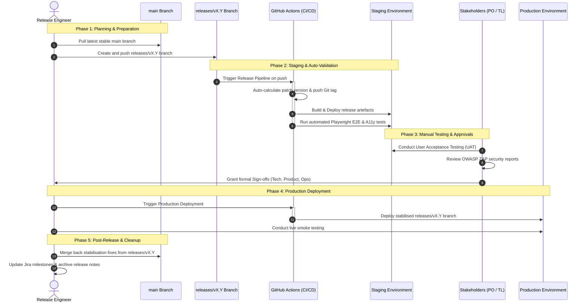

Follow this process to safely promote, validate, and release changes for the Accessing Childcare Entitlement Checker.

## Follow the release steps

Progress through these five distinct phases to promote code from integration to live production operation.



### Phase 1: Plan and prepare the release

1. **Identify the Scope**: Review the merged pull requests on the `main` branch since the last release. Group features and bug fixes into a logical release version.
2. **Assign the Version**: Determine the next major/minor version number using Semantic Versioning (e.g., `vX.Y`).
3. **Create the Release Branch**:
   * Create a release branch named `releases/vX.Y` from the latest stable commit on `main`. Note the plural `releases/` name prefix, which is strictly validated by the CI/CD configuration.
   * Run the following commands:
     ```bash
     git checkout main
     git pull
     git checkout -b releases/vX.Y
     git push -u origin releases/vX.Y
     ```

### Phase 2: Deploy to staging and run automated validation

1. **Trigger Staging Deployment & Automated Versioning**: Push to the `releases/vX.Y` branch to trigger the GitHub Release Pipeline.
   * **Automated Tagging & Versioning**: The pipeline immediately runs the `version` job, which validates the branch name, checks the existing Git tags to calculate the next patch version (e.g., `vX.Y.0` or `vX.Y.1`), and automatically creates and pushes the Git tag to the repository. *Do not manually create or push version tags; the pipeline fully automates this step.*
   * **Staging Deployment**: The pipeline builds the release artefacts and deploys them automatically to the Staging environment.
2. **Verify Automatically**:
   * Once deployed, verify that the automated End-to-End (E2E) test suite runs using Playwright against Staging.
   * Run automated accessibility checks against Staging to ensure compliance with digital standards.
   * Confirm that the automated pipeline completes successfully with zero critical or high-severity failures.

### Phase 3: Execute manual testing and acquire approvals

Conduct manual validation alongside automated tests to ensure the service meets all user and operational requirements:

1. **Perform User Acceptance Testing (UAT)**: Ensure the Product Owner and business testers review the new features on Staging to verify they meet the defined acceptance criteria.
2. **Conduct Exploratory & Regression Testing**: Execute targeted manual testing of critical paths (such as the eligibility calculator flow) to guarantee no regressions have been introduced.
3. **Verify Security**: Confirm that weekly OWASP ZAP security scan reports have been reviewed and that no new high/medium alerts are left unresolved.
4. **Acquire Sign-Offs**: Collect and log formal approvals from key roles (see [Acquire mandatory release sign-offs](#acquire-mandatory-release-sign-offs) below).

### Phase 4: Deploy to production

1. **Schedule the Release Window**: Secure an approved operational window (preferably low-traffic periods) and ensure the deployment does not clash with critical policy change dates.
2. **Deploy to Production**:
   * Trigger the deployment workflow in GitHub Actions, targeting the stabilised `releases/vX.Y` branch.
   * Monitor the deployment progress, logs, and system metrics closely during the rollout.
3. **Perform Smoke Testing**: Once the deployment completes, execute a quick, non-destructive smoke test of the live service to confirm core functionality (such as loading the landing page and verifying basic site elements).

### Phase 5: Complete post-release steps and cleanup

1. **Verify the Release Tag**: Confirm that the automated release tag was correctly generated and pushed by the pipeline, and verify that the GitHub Release description is fully populated.
2. **Reconcile Branches (Cherry-Pick / Merge Back)**:
   * If you made any bug fixes or configuration changes directly on the `releases/vX.Y` branch during the stabilisation phase, cherry-pick or merge them back into `main` via PR to prevent codebase drift.

## Acquire mandatory release sign-offs

Pass these three mandatory gates before deploying any release to the live production environment. Ensure each role verifies their specific area of system health.

### 1. Obtain Technical sign-off
* Owner: Lead Engineer / Technical Lead
* Verification Scope:
  - Run all automated unit, component, and E2E checks and ensure they pass.
  - Resolve outstanding critical/high static analysis warnings or dependency alerts (Dependabot).
  - Verify and document that architectural patterns have been followed.
  - Confirm active security scans (OWASP ZAP) show no high-risk vulnerabilities.

### 2. Obtain Product sign-off
* Owner: Product Owner / Product Manager
* Verification Scope:
  - Confirm features meet user expectations and functional specifications.
  - Verify UX design conforms to GDS and DfE standards.
  - Complete User Acceptance Testing (UAT) and secure sign-offs from business stakeholders.
  - Ensure release-specific content, guidance text, or legal references are accurate.

### 3. Obtain Operations & delivery sign-off
* Owner: Delivery Manager / Service Owner
* Verification Scope:
  - Schedule the deployment for an approved window.
  - Prep communication channels and ensure stakeholders are aware of potential service updates.
  - Update runbooks and operational documentation.
  - Inform support/helpdesk teams of upcoming user-facing changes.

### Sign-off matrix

| Role             | Gate                      | Prerequisite for                    |
|:-----------------|:--------------------------|:------------------------------------|
| Technical Lead   | Technical Sign-Off        | Transition to UAT & Prod Deployment |
| Product Owner    | Product Sign-Off          | Prod Deployment                     |
| Delivery Manager | Release Schedule Sign-Off | Prod Deployment                     |

## Execute emergency / hotfix releases

Streamline the release process using these fast-track steps when you identify a critical production defect (such as a service outage, security vulnerability, or critical policy miscalculation):

1. **Authorize the Fix**: Convene an emergency meeting with the Tech Lead and Product Owner to agree on the scope and authorise an emergency hotfix.
2. **Branch the Code**: Develop the fix on a `hotfix/*` branch split off the active release branch as described in the [Hotfix Flow](/explanation/branching-strategy/#hotfix-flow).
3. **Promote the Fix**:
   * Merge the fix into the active `releases/vX.Y` branch.
   * Deploy automatically to Staging and validate via Playwright automated tests.
4. **Shortcut Approvals**: Grant technical sign-off and product sign-off concurrently on the PR itself to fast-track the deployment.
5. **Push to Production**: Deploy the updated release branch immediately to Production.
6. **Reconcile the Code**: Immediately after the production deployment, cherry-pick the hotfix back to `main` to prevent master branch drift.
