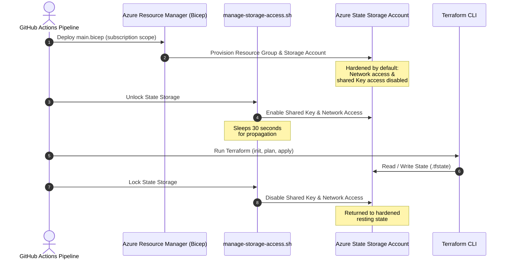

Follow this guide to execute the automated bootstrapping process using Azure Bicep and Azure CLI to securely provision and lock the remote backend storage required for Terraform state management.

## Review the bootstrapping architecture

We use Azure Bicep to provision the bootstrap infrastructure. The bootstrap phase runs before any Terraform execution. It is scoped at the Azure Subscription level, allowing Bicep to dynamically create or manage the target resource group and populate it with the state backend resources.

### Identify the provisioned components

The bootstrap phase defines and creates these key resources under `infra/bicep/`:

1. **Resource Group**: Create an isolated resource group specifically for managing state storage (e.g., `s279d01rg-uks-cec-terraform`).
2. **Virtual Network & Networking**:
   * Deploy a dedicated Virtual Network (e.g., `s279d01-uks-cec-vnet-tf-state` with address prefix `10.1.0.0/16`).
   * Provision a custom subnet (e.g., `s279d01-uks-cec-snet-tf-state` with address prefix `10.1.0.0/24`).
   * Bind a custom Network Security Group (NSG) (named `${subnetName}-nsg`) to the subnet.
   * Create a Private DNS Zone named `privatelink.blob.core.windows.net` (`privatelink.blob.${environment().suffixes.storage}`) and link it to the Virtual Network (`${vnetName}-link`).
3. **Private Endpoint**:
   * Establish a private endpoint (named `${storageAccountName}-pe`) that connects the storage account securely to the custom subnet using the `blob` sub-resource.
   * Configure a Private DNS Zone Group to register the endpoint's private IP with the `privatelink.blob.core.windows.net` zone.
4. **Storage Account**: Host the blob state on an account hardened by default with:
   * Minimum TLS Version set to `TLS1_2`.
   * Secure transit only (`supportsHttpsTrafficOnly: true`).
   * Disabled Shared Key Access (`allowSharedKeyAccess: false`).
   * Disabled Public Network Access (`publicNetworkAccess: 'Disabled'`).
   * Disabled Public Blob Access (`allowBlobPublicAccess: false`).
   * Default network action of `Deny` with bypass allowed only for `AzureServices`.
   * SKU `Standard_ZRS` (Zone-Redundant Storage) to ensure high availability.
5. **Blob Service & Container**:
   * Enable versioning on the blob service (`isVersioningEnabled: true`).
   * Enforce soft-delete retention policies (14 days) for both blobs and containers.
   * Create a private blob container named `tfstate`.
6. **Log Analytics Workspace & Diagnostics**:
   * Dedicate a workspace to tracking operations (e.g., `279d01-uks-cec-law-tf-state`) with a data retention period of 90 days and the `PerGB2018` SKU.
   * Configure diagnostic settings on the Storage Account's Blob Service to send logs (`StorageRead`, `StorageWrite`, `StorageDelete`) and transactions to the Log Analytics Workspace for security auditing (named `${storageAccountName}-blob-diag`).

## Skip bootstrapping in CI/CD pipelines

Executing the Bicep template on every deployment checks and ensures that the Azure Resource Group and Storage Account exist and are correctly configured. However, this check can take 3+ minutes to complete on every run.

To optimize deployment times when the backend infrastructure is already bootstrapped:
1. Define a GitHub Configuration Variable named `BOOTSTRAP_TF` at the environment, repository, or organization level.
2. Set its value to `'false'`.

When `BOOTSTRAP_TF` is set to `'false'`, the pipeline skips the Bicep template deployment steps entirely, but still securely extracts the backend parameters directly from the configuration files to initialize and lock the remote state backend. If the variable is set to `'true'` or is omitted, the bootstrap steps will run normally.
