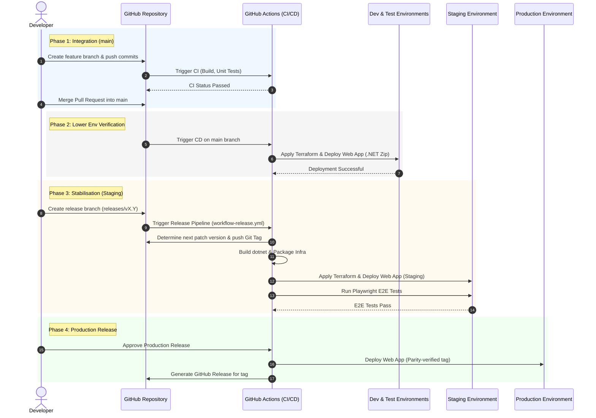

The path to live defines the progression of code modifications from the local development environment to the production environment. This process incorporates quality assurance gates, automated regression testing, and controlled promotion of artifacts.

Sequential phases and quality gates are outlined in the diagram below:

### Local development
* Features and bug fixes are implemented in short-lived feature branches created from `main`.
* Local validation is conducted by executing unit/component tests and linting.
* Changes are submitted for review via a Pull Request (PR) to `main`.

### Integration & continuous deployment (Dev & test)
* Quality Gate: Raising a PR triggers the Continuous Integration (CI) pipeline, executing builds, unit tests, and security scans.
* Upon merging into `main`, the automated deployment pipeline executes the following steps:
    1. Compilation of the ASP.NET Core package.
    2. Application of infrastructure changes using Terraform.
    3. Deployment of the application package to the Development and Test environments.
* Continuous feedback is generated as these environments continuously execute the latest integrated code.

### Release stabilisation (Staging)
* Release branches are created off `main` following the naming convention `releases/vX.Y` (where `X.Y` corresponds to the target Major.Minor release version).
* Push operations to a `releases/` branch trigger the Release Pipeline (`workflow-release.yml`):
    * Automatic Versioning: The pipeline validates the branch name, retrieves git tags, determines the next patch version (e.g., `v1.2.0` or `v1.2.1`), and creates and pushes the version tag to GitHub.
    * Build and Infrastructure Packaging: The .NET application is built into a zip archive and Terraform infrastructure configurations are packaged.
    * Staging Deployment: Terraform configurations are applied and the zip package is deployed to the Staging environment.
    * Automated E2E Verification: Playwright integration and E2E regression tests are executed against the active Staging URL to verify functional integrity.

### Promotion to production
* Following full validation of the release candidate in Staging (incorporating E2E testing, accessibility audits, and stakeholder/UAT sign-offs):
    * Production Deployment: The release package is promoted and deployed to the Production environment using the matching version tag to guarantee artifact parity.
    * *Note: Continuous automated deployment to production and automated accessibility checking are integrated into the pipeline structure, allowing promotion following manual sign-off.*
    * GitHub Release: A formal GitHub Release is generated for the successful deployment with the corresponding version tag.
