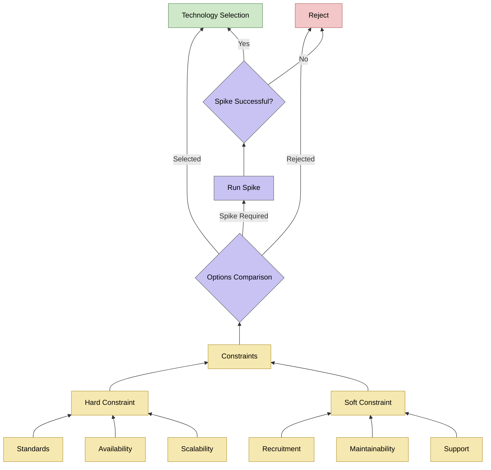

The decision-making process follows the flow shown below:

The "standards" hard constraint includes typical implementations with the wider DfE landscape, as well as GDS compliance, for example, the use of Azure is not a standard, but a hard constraint as the preferred cloud platform for the department.

We record all significant decisions made during the development of this service. Use the navigation menu to explore these decision details.