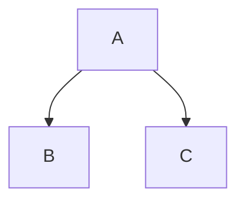

This project uses [Eleventy](https://www.11ty.dev/) and the [X-GOVUK plugin](https://x-govuk.github.io/govuk-eleventy-plugin/) to generate DfE-branded technical documentation from Markdown files.

## Local Development

To preview your changes locally:

1.  Navigate to the `docs` directory.
2.  Run `npm install` (first time only).
3.  Run `npm start`.
4.  View at `http://localhost:8080/`.

---

## Adding a New Document

### 1. Create the File
Create a new `.md` file in one of the existing directories (`architecture/`, `decisions/`, or `developers/`).

### 2. Add Front Matter
Every page needs "Front Matter" at the top to set the title and navigation key. 

```markdown
---
title: My New Page Title
eleventyNavigation:
  key: My Page Key
---
```

> **Note**: You don't need to set `layout` or `parent` for individual files. These are automatically applied based on the folder you put the file in.

---

## Managing Navigation

### Main Navigation (Horizontal Bar)
The top-level menu items are managed in `docs/eleventy.config.js`. 

To add a new main section:
1.  Create a new folder (e.g., `docs/guides/`).
2.  Add an `index.md` to that folder.
3.  Update the `serviceNavigation.navigation` array in `eleventy.config.js`.

### Sub-Navigation (Sidebar Menu)
Sub-navigation is handled automatically for each folder using a "Directory Data" file (e.g., `developers/developers.11tydata.js`).

This file ensures that:
-   All pages in the folder use the `sub-navigation` layout.
-   All pages (except the index) are correctly nested under the section's main link.

If you create a new folder, copy an existing `.11tydata.js` file into it and update the `sectionKey` and `parent` strings to match your new folder name.

---
## Diagrams (Mermaid)

You can include diagrams using standard Markdown code blocks:



These are rendered on the client side using a custom script that ensures they are responsive and DfE-branded.

---

## Images

Images should be stored in an `images` folder within the same directory as the Markdown file that references them.

### Referencing an Image
Use standard Markdown syntax to include an image:

```markdown

```

If you need to reference an image from another directory, use relative paths:

```markdown

```

Common image formats (PNG, JPG, SVG, etc.) are automatically copied to the built site.

---

## Deployment
Documentation is automatically built and deployed to **GitHub Pages** whenever you:
- Push to `main`
- Push to a `release/*` branch
- Create/update a Pull Request (build validation only)
